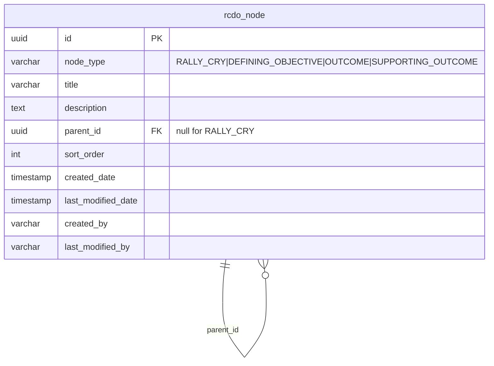

# feat: RCDO Strategy Hierarchy (Workstream B)

## Summary

Build the RCDO strategy tree — Rally Cry → Defining Objective → Outcome → Supporting Outcome — as persistent, audited data with read-only APIs and a minimal read-only viewer. This is the **link target** for workstream C: weekly commitments reference RCDO nodes, so B's job is to expose stable node identifiers and the tree shape, nothing more.

Scope is **read-only** (confirmed with user, 2026-06-02): nodes are created by a Flyway seed migration, not by API. No create/update/delete endpoints, no manager/IC permission split, no management UI — those are deferred to a later workstream that pulls PRD feature #1 ("RCDO management") forward.

---

## Problem Frame

The PRD's core premise is that every weekly commitment maps to a node in the RCDO hierarchy, giving ICs and managers real-time visibility into strategic alignment. None of that is possible until the hierarchy exists as queryable data. Workstream A built the platform substrate (Spring Boot backend with JPA auditing + Flyway + JWT, Vite/React/Redux MF frontend) but contains zero domain tables. Workstream C (the weekly lifecycle) is blocked: it cannot link a commitment to a Supporting Outcome that does not exist.

B closes that gap with the smallest thing that unblocks C: the tree as data, a read API to fetch it, and seed content so C has real nodes to link against.

---

## Scope Boundaries

### In scope
- A single self-referential `rcdo_node` table modeling all four levels (adjacency list + type discriminator). See Key Technical Decision 1.
- JPA entity extending `AbstractAuditingEntity`, with a Spring Data repository.
- Read-only REST API (JWT-secured): fetch the full tree, and resolve a single node by id.
- A Flyway seed migration populating a representative RCDO tree.
- A read-only React tree viewer consuming the API via RTK Query.
- Tests at every layer to clear the JaCoCo 80% line gate and the Vitest component-coverage expectation.

### Deferred to Follow-Up Work
- RCDO **management** (create/update/delete endpoints) and the manager-owns-RallyCry/DO, IC-proposes-SupportingOutcome permission split — a separate workstream pulling PRD feature #1 forward.
- Pagination of node lists — the PRD assigns Spring Data `Pageable` to workstream F (manager dashboard), not B. The tree is small and fetched whole.
- The commitment→RCDO foreign key itself — that belongs to workstream C's commitment entity; B only guarantees stable node ids it can point at.

### Out of scope (other workstreams)
- Weekly lifecycle state machine (C), chess layer (E), manager dashboard (F), E2E/perf hardening (G).

---

## Requirements Traceability

| Source | Requirement | Addressed by |
|---|---|---|
| PRD functional req | "Weekly commit CRUD with RCDO hierarchy linking" — the *link target* half | U1, U2, U3 (model + read API) |
| PRD core feature #1 | "RCDO management" — *read* portion only; management deferred | U2, U3, U5 |
| Roadmap workstream B | "RCDO hierarchy (model + read API + seed)", depends on A | All units |
| Roadmap | B exists primarily as the link target for C — must expose stable node ids | KTD 1, KTD 2 |
| PRD code quality | All entities extend `AbstractAuditingEntity` | U1 |
| PRD code quality | JaCoCo ≥80% backend line coverage | U1–U3 test scenarios |
| PRD code quality | Vitest unit tests for all components | U5 |
| PRD code quality | RTK Query for all API calls + cache invalidation | U4 (providesTags) |
| PRD off-limits | `@Getter/@Setter/@Builder` not `@Data`; Tailwind only; no Saga/Thunk | U1, U4, U5 |
| PRD tech constraint | Spring Data JPA + Hibernate, Flyway, Postgres 16, JWT | U1, U2, U3 |

---

## Key Technical Decisions

### KTD 1 — Single self-referential table (adjacency list), not four tables

Model all four RCDO levels as rows in one `rcdo_node` table with a `node_type` discriminator (`RALLY_CRY`, `DEFINING_OBJECTIVE`, `OUTCOME`, `SUPPORTING_OUTCOME`) and a nullable `parent_id` self-FK.

**Why:** The PRD states "commitments link to any node, but Supporting Outcome is the common path." With four separate tables, a commitment's RCDO link would need four nullable FKs (or a polymorphic association) — awkward, and it pushes complexity into workstream C, the consumer we exist to serve. With one table, C links a commitment to RCDO via **one** `rcdo_node_id` FK regardless of level. The hierarchy is fixed-depth (4), read-mostly, and small, so an adjacency list keeps the entity and migration trivial to keep in `ddl-auto: validate` sync.

**Rejected — four tables (one per level):** Stronger per-level typing, but multiplies the entity/repository/migration surface 4×, complicates the C-side link, and gains nothing for a read-only fixed hierarchy. Level integrity is instead enforced by a `parent_type` rule (see KTD 3).

**Rejected — closure table / nested set:** Built for arbitrary-depth trees and heavy ancestor/descendant queries. We have neither. Over-engineering for a 4-level static tree.

### KTD 2 — UUID primary keys via `gen_random_uuid()`

RCDO nodes use `UUID` ids. The workstream A baseline migration (`V1__baseline.sql`) deliberately enables `pgcrypto` "to provide `gen_random_uuid()` for later migrations" — a clear signal that domain entities use UUID. Stable, non-sequential UUIDs are good FK targets for C (no cross-table id collisions, safe to expose in URLs). Entity uses `@Id @GeneratedValue` mapping to a `uuid` column defaulting to `gen_random_uuid()`.

(The only existing entity, the test-only `TestAuditEntity`, uses `Long`+IDENTITY, but it predates any domain modeling and the baseline's pgcrypto provisioning overrides that as the domain convention.)

### KTD 3 — Hierarchy integrity enforced in the seed + a type-rule, not deep DB constraints

A node's legal parent is determined by type: DEFINING_OBJECTIVE→RALLY_CRY, OUTCOME→DEFINING_OBJECTIVE, SUPPORTING_OUTCOME→OUTCOME, RALLY_CRY→null. Since B is read-only (no API writes), enforce this via (a) a `parent_id` self-FK for referential integrity and (b) correct seed data. A CHECK-constraint-based `parent_type` rule is noted as a follow-up hardening for when the management workstream adds writes — not needed while the only writer is a controlled seed migration.

### KTD 4 — Thin service layer + DTO responses

No controller→service→repository precedent exists (HealthController hits `DataSource` directly). For RCDO, introduce a thin `RcdoService` (repository-backed) and return typed DTO records, not entities. Rationale: entities carry audit fields and a lazy `parent`/`children` association that would serialize awkwardly and leak the persistence shape; a `RcdoNodeDto` (id, type, title, parentId, children) gives the frontend a clean tree. This establishes the controller→service→repo + DTO pattern that C/E/F will reuse.

### KTD 5 — RTK Query endpoints in the existing base slice, with `providesTags`

Add RCDO endpoints to the existing single `createApi` slice in `frontend/src/store/api.ts` (matches the current single-file convention; `injectEndpoints` is unnecessary at this size). Define an `RcdoNode` tag type and have the tree query `providesTags` — establishes the cache-invalidation convention the management workstream will pair `invalidatesTags` with. Reuse the existing `baseQuery` (in-memory bearer-token injection); do not add a separate auth path.

---

## High-Level Technical Design

*This illustrates the intended approach and is directional guidance for review, not implementation specification. The implementing agent should treat it as context, not code to reproduce.*

Data shape (one table, self-referential):



Request flow (read-only, JWT-secured):

```
GET /api/rcdo/tree   -> RcdoController -> RcdoService.getTree()
                        -> repository.findAll() -> assemble nested RcdoNodeDto roots
GET /api/rcdo/nodes/{id} -> RcdoController -> RcdoService.getNode(id)
                        -> repository.findById() -> RcdoNodeDto (404 if absent)
```

Frontend: `useGetRcdoTreeQuery()` → `RcdoTree` component renders nested `<ul>` with loading/error/data branches (mirrors `HealthCheck.tsx`).

---

## Output Structure

New files this plan creates (repo-relative):

```
backend/src/main/java/com/weeklycommit/rcdo/
    RcdoNode.java              # entity (U1)
    RcdoNodeType.java          # enum (U1)
    RcdoNodeRepository.java    # Spring Data repo (U1)
    RcdoNodeDto.java           # response record (U3)
    RcdoService.java           # tree assembly (U3)
    RcdoController.java         # read endpoints (U2/U3)
backend/src/main/resources/db/migration/
    V2__rcdo_tables.sql        # schema (U1)
    V3__rcdo_seed.sql          # seed tree (U2)
backend/src/test/java/com/weeklycommit/rcdo/
    RcdoMigrationTest.java     # migration + validate (U1)
    RcdoNodeRepositoryTest.java# repository/tree queries (U1)
    RcdoControllerTest.java    # endpoint IT incl. auth (U2/U3)
    RcdoServiceTest.java       # tree assembly unit test (U3)
frontend/src/store/
    api.ts                     # MODIFIED: add rcdo endpoints + tag (U4)
frontend/src/routes/
    RcdoTree.tsx               # read-only viewer (U5)
frontend/src/__tests__/
    RcdoTree.test.tsx          # Vitest component test (U5)
frontend/src/App.tsx           # MODIFIED: surface the viewer (U5)
```

Per-unit `**Files:**` sections are authoritative; this tree is the scope-shape overview.

---

## Implementation Units

### U1. RCDO entity, repository, and schema migration

**Goal:** The `rcdo_node` table exists, matches a JPA entity exactly (so `ddl-auto: validate` passes), and is queryable via a Spring Data repository.

**Requirements:** PRD "all entities extend AbstractAuditingEntity"; roadmap B "model". Advances KTD 1, 2, 3.

**Dependencies:** none (first unit; builds on workstream A foundation).

**Files:**
- `backend/src/main/java/com/weeklycommit/rcdo/RcdoNode.java` (create)
- `backend/src/main/java/com/weeklycommit/rcdo/RcdoNodeType.java` (create — enum)
- `backend/src/main/java/com/weeklycommit/rcdo/RcdoNodeRepository.java` (create)
- `backend/src/main/resources/db/migration/V2__rcdo_tables.sql` (create)
- `backend/src/test/java/com/weeklycommit/rcdo/RcdoMigrationTest.java` (create)
- `backend/src/test/java/com/weeklycommit/rcdo/RcdoNodeRepositoryTest.java` (create)

**Approach:**
- `RcdoNode extends AbstractAuditingEntity`, class-level `@Getter @Setter` (and `@Builder` permitted). `@Id` UUID mapped to a `uuid` column with DB default `gen_random_uuid()`. Fields: `nodeType` (enum, `@Enumerated(EnumType.STRING)`, `node_type` column), `title`, `description` (nullable), `parentId` (UUID, nullable, `parent_id`), `sortOrder` (`sort_order`). Model `parent`/`children` as a self-referential association only if needed for assembly; KTD 4 assembles the tree in the service from a flat `findAll()`, so a plain `parentId` column is sufficient and avoids lazy-loading complexity.
- `V2__rcdo_tables.sql`: `CREATE TABLE rcdo_node` with snake_case columns matching the entity exactly, `parent_id` self-FK (`REFERENCES rcdo_node(id)`), audit columns matching `AbstractAuditingEntity`'s mappings. Index on `parent_id`.
- Repository: `interface RcdoNodeRepository extends JpaRepository<RcdoNode, UUID>`. Add `List<RcdoNode> findByParentIdIsNull()` (roots) and `List<RcdoNode> findByNodeType(RcdoNodeType type)` for assembly/tests.

**Patterns to follow:**
- Base entity / auditing: `backend/src/main/java/com/weeklycommit/common/AbstractAuditingEntity.java`
- Entity template: `backend/src/test/java/com/weeklycommit/common/TestAuditEntity.java`
- Repository template: `backend/src/test/java/com/weeklycommit/common/TestAuditEntityRepository.java`
- Migration naming/baseline: `backend/src/main/resources/db/migration/V1__baseline.sql`
- Migration test pattern: `backend/src/test/java/com/weeklycommit/config/FlywayBaselineTest.java`
- IT base (Zonky Postgres): `backend/src/test/java/com/weeklycommit/support/AbstractPostgresIT.java`

**Test scenarios:**
- `RcdoMigrationTest` (extends `AbstractPostgresIT`): after context load, Flyway reports V1, V2 applied (mirror `FlywayBaselineTest`'s applied-count assertion); `ddl-auto: validate` context-load succeeds (proves entity↔migration parity — the primary drift guard).
- `RcdoNodeRepositoryTest` (extends `AbstractPostgresIT`): saving a node populates audit fields (`createdBy` = test principal, `createdDate` non-null) — proves auditing inheritance. Saving a child with a `parentId` referencing a saved root persists and reads back. `findByParentIdIsNull()` returns only roots. `findByNodeType(SUPPORTING_OUTCOME)` returns only that level. Saving a child whose `parentId` is a non-existent UUID violates the FK (assert persistence exception) — proves referential integrity.

**Verification:** `./gradlew check` passes (validate + JaCoCo) with the new table and entity; repository tests green against embedded Postgres.

---

### U2. Seed migration + read endpoint for the full tree

**Goal:** A representative RCDO tree exists in the DB via seed, and `GET /api/rcdo/tree` returns it (JWT-secured).

**Requirements:** Roadmap B "seed" + "read API"; PRD "RCDO hierarchy linking" (link target). Advances KTD 3, 5.

**Dependencies:** U1.

**Files:**
- `backend/src/main/resources/db/migration/V3__rcdo_seed.sql` (create)
- `backend/src/main/java/com/weeklycommit/rcdo/RcdoController.java` (create — `/tree` endpoint; `/nodes/{id}` added in U3)
- `backend/src/test/java/com/weeklycommit/rcdo/RcdoControllerTest.java` (create — tree + auth cases; node-by-id case added in U3)

**Approach:**
- `V3__rcdo_seed.sql`: insert a small but complete tree — at least 1 Rally Cry → 2 Defining Objectives → Outcomes → Supporting Outcomes, with explicit UUIDs (or `gen_random_uuid()` with a deterministic structure) and correct `parent_id` wiring per KTD 3's type rule. Set `created_by`/`last_modified_by` to a system marker (e.g. `'system'`, matching `SystemPrincipalResolver.SYSTEM`) since auditing listeners do not fire on raw SQL inserts — the audit columns are NOT NULL via the superclass mapping, so the seed must populate them.
- `RcdoController` under `/api/rcdo`, `@GetMapping("/tree")` → `RcdoService.getTree()` (service introduced in U3; for U2 the controller may call the repository directly and be refactored in U3, OR sequence U3 before wiring the endpoint — implementer's choice, but the endpoint's final form delegates to the service).

**Execution note:** Start with a failing `RcdoControllerTest` for the `/api/rcdo/tree` request/response contract (including the 401-without-token case) before wiring the controller.

**Patterns to follow:**
- Controller template: `backend/src/main/java/com/weeklycommit/health/HealthController.java`
- Security (auth requirements): `backend/src/main/java/com/weeklycommit/config/SecurityConfig.java`
- Auth test cases (401/valid-token): `backend/src/test/java/com/weeklycommit/config/SecurityConfigTest.java`
- Test JWT / VALID_TOKEN: `backend/src/test/java/com/weeklycommit/support/TestSecurityConfig.java`
- MockMvc endpoint test: `backend/src/test/java/com/weeklycommit/health/HealthControllerTest.java`

**Test scenarios:**
- `Covers PRD "RCDO hierarchy linking".` `GET /api/rcdo/tree` with `Bearer valid-token` returns 200 and a nested JSON tree whose root is the seeded Rally Cry with its Defining Objective children nested under it (assert structure + at least one leaf Supporting Outcome present).
- `GET /api/rcdo/tree` with **no** Authorization header returns 401 (mirrors `SecurityConfigTest.protectedPathRejectsMissingToken`) — proves the endpoint is secured-by-default, not accidentally public like `/health`.
- Seed integrity (in `RcdoMigrationTest` or here): after migrations, exactly one root exists and every non-root node's `parentId` resolves to an existing node of the legal parent type.

**Verification:** Authenticated request returns the seeded tree; unauthenticated request is rejected; migrations apply cleanly in CI.

---

### U3. Service-layer tree assembly + single-node resolve endpoint

**Goal:** Tree assembly lives in a testable `RcdoService` returning DTOs, and `GET /api/rcdo/nodes/{id}` resolves any node (the "link to any node" path C needs).

**Requirements:** PRD "commitments link to any node"; roadmap "read API". Advances KTD 4, 5.

**Dependencies:** U1, U2.

**Files:**
- `backend/src/main/java/com/weeklycommit/rcdo/RcdoNodeDto.java` (create — record)
- `backend/src/main/java/com/weeklycommit/rcdo/RcdoService.java` (create)
- `backend/src/main/java/com/weeklycommit/rcdo/RcdoController.java` (modify — add `/nodes/{id}`, delegate `/tree` to service)
- `backend/src/test/java/com/weeklycommit/rcdo/RcdoServiceTest.java` (create)
- `backend/src/test/java/com/weeklycommit/rcdo/RcdoControllerTest.java` (modify — add node-by-id cases)

**Approach:**
- `RcdoNodeDto` record: `id`, `nodeType`, `title`, `description`, `parentId`, `List<RcdoNodeDto> children`. For `/nodes/{id}`, `children` may be empty/omitted (single-node resolve returns the node and its identity, not its subtree) — decide and keep the contract consistent; recommended: `/tree` returns nested children, `/nodes/{id}` returns the node with its direct children only.
- `RcdoService.getTree()`: load all nodes once (`findAll()`), build a `Map<UUID, RcdoNodeDto>`, link children to parents in memory, return roots. O(n), avoids N+1 lazy loads. `getNode(UUID)`: `findById` → DTO, throw a not-found that maps to 404.
- Controller: 404 handling for unknown id (Spring's `ResponseStatusException` or an `@ExceptionHandler` — mirror minimal style; no global handler exists yet, so a local one is fine).

**Patterns to follow:**
- Controller/security/test-auth patterns as in U2.
- AssertJ unit-test style (no Spring context for `RcdoServiceTest` — pure assembly logic over an in-memory list or a mocked repository), mirroring `backend/src/test/java/com/weeklycommit/config/JwtPrincipalResolverTest.java` (plain unit test, no `AbstractPostgresIT`).

**Test scenarios:**
- `RcdoServiceTest` (pure unit, mocked/in-memory repo): a flat list of nodes with `parentId` links assembles into the correct nested tree (root has expected children, leaf has none). A node whose `parentId` points to a missing parent is attached nowhere / surfaced as an orphan root (assert chosen behavior). Empty repository → empty tree (no exception).
- `getNode` returns the DTO for an existing id; returns not-found for a random UUID.
- `RcdoControllerTest`: `GET /api/rcdo/nodes/{seededId}` with valid token → 200 + that node's DTO. `GET /api/rcdo/nodes/{randomUuid}` with valid token → 404. `GET /api/rcdo/nodes/{id}` with no token → 401.

**Verification:** Service assembles the seeded tree correctly in isolation; both endpoints behave under auth; JaCoCo line coverage for the `rcdo` package keeps `check` ≥80%.

---

### U4. RTK Query endpoints for the RCDO tree

**Goal:** The frontend can fetch the tree and a single node through the existing RTK Query slice, with cache tagging in place.

**Requirements:** PRD "RTK Query for all API calls + cache invalidation". Advances KTD 5.

**Dependencies:** U2 (tree endpoint must exist to call). U3 for the node endpoint.

**Files:**
- `frontend/src/store/api.ts` (modify)

**Approach:**
- Add TS interfaces mirroring `RcdoNodeDto` (`RcdoNode` with `children: RcdoNode[]`). Add `getRcdoTree` query (`query: () => '/api/rcdo/tree'`) and `getRcdoNode` query (`query: (id) => \`/api/rcdo/nodes/${id}\``). Add `tagTypes: ['RcdoNode']` to the slice and `providesTags` on the tree query (list-style tag) — establishes the invalidation seam for the future management workstream. Export `useGetRcdoTreeQuery` / `useGetRcdoNodeQuery`.
- Reuse the existing `baseQuery` (token injection via `prepareHeaders`) — no new auth path, no localStorage.

**Patterns to follow:**
- RTK Query base slice: `frontend/src/store/api.ts` (extend the `endpoints` map, export hooks — mirror `useGetHealthQuery`)
- Store (no change needed): `frontend/src/store/index.ts`

**Test scenarios:**
- Covered via U5's component test (the hook is exercised through the rendered component, matching how `useGetHealthQuery` is tested through `HealthCheck.test.tsx` rather than in isolation).
- `Test expectation: none at this unit` — the endpoint additions are declarative RTK config with no standalone logic; behavior is asserted in U5.

**Verification:** `npm run build` (tsc strict) passes with the new typed endpoints; hooks importable.

---

### U5. Read-only RCDO tree viewer component

**Goal:** A React component renders the RCDO tree with loading/error/data states, reachable from the app root.

**Requirements:** Roadmap B "minimal UI"; PRD "Vitest unit tests for all components", Tailwind-only styling. Advances KTD 5.

**Dependencies:** U4.

**Files:**
- `frontend/src/routes/RcdoTree.tsx` (create)
- `frontend/src/__tests__/RcdoTree.test.tsx` (create)
- `frontend/src/App.tsx` (modify — surface the viewer alongside the existing health check)

**Approach:**
- `RcdoTree` default-exported component: `const { data, isLoading, isError } = useGetRcdoTreeQuery();` with explicit loading / error (`role="alert"`) / success branches, mirroring `HealthCheck.tsx`. Render the tree as nested `<ul>`/`<li>` recursively; show each node's `title` and a type label. Tailwind utility classes only (indentation via padding/margin utilities); Flowbite-React components are available if useful but plain Tailwind is sufficient.
- `App.tsx`: render `<RcdoTree />` (the app already centers content; add it below the heading). No new MF expose — it loads through the existing single lazy boundary in `WeeklyCommitApp.tsx`.

**Patterns to follow:**
- Route component with hook + loading/error/data: `frontend/src/routes/HealthCheck.tsx`
- Vitest component test (renderWithStore, `vi.stubGlobal('fetch', ...)`, `waitFor`): `frontend/src/__tests__/HealthCheck.test.tsx`
- App composition: `frontend/src/App.tsx`, `frontend/src/WeeklyCommitApp.tsx`

**Test scenarios:**
- Happy path: with fetch stubbed to return a nested tree JSON, the component renders the root Rally Cry title and a nested Supporting Outcome title after `waitFor`.
- Loading: before the stubbed fetch resolves, a loading indicator is shown.
- Error: fetch stubbed to a 500 (or rejected) → the `role="alert"` error branch renders.
- Token injection (mirror `HealthCheck.test.tsx`): the request carries `Authorization: Bearer <token>` when a token provider is set (assert via `fetchMock.mock.calls[0][0]`).

**Verification:** `npm run lint`, `npm run test` (Vitest, all scenarios green), `npm run build` all pass; the viewer renders the seeded tree when run against the backend.

---

## System-Wide Impact

- **Workstream C (consumer):** B's deliverable is the stable `rcdo_node.id` (UUID) that C's commitment entity will FK to. C should link via a single `rcdo_node_id` column (KTD 1 makes this possible). The `/api/rcdo/nodes/{id}` endpoint is C's validation path for "does this link target exist."
- **Migration ordering:** V2/V3 are the first domain migrations. Once merged, they are immutable history — any change to RCDO schema after this lands is a new V4+ migration, never an edit to V2/V3.
- **Coverage denominator:** the `rcdo` package is fully counted by JaCoCo (no `*Config` exclusion applies). Entities/DTOs are mostly Lombok/record-generated (excluded via `lombok.config` / record semantics), but the service and controller carry real logic that the tests above must cover to hold the 80% line gate.
- **Frontend bundle:** the viewer loads through the existing MF lazy boundary; no new shared dependency is introduced, so `vite.config.ts` `shared` is unchanged.

---

## Risks & Mitigations

| Risk | Mitigation |
|---|---|
| Entity↔migration drift fails `ddl-auto: validate` at context load | U1's `RcdoMigrationTest` asserts validate-passing context load — drift fails fast in CI, not at runtime |
| Seed inserts violate NOT NULL audit columns (listeners don't fire on raw SQL) | U2 approach explicitly populates `created_by`/`last_modified_by`/dates in the seed SQL |
| JaCoCo 80% gate fails because entity/DTO inflate the denominator | DTO is a record, entity is Lombok-generated (both effectively excluded); tests target the service/controller logic that counts |
| `/api/rcdo/*` accidentally public | U2/U3 test the 401-without-token case explicitly |
| Tree assembly N+1 if modeled via lazy JPA associations | KTD 4 assembles in-memory from a single `findAll()` — no per-node lazy loads |

---

## Verification Strategy

- **Backend:** `cd backend && JAVA_HOME=<JDK21> ./gradlew check` — runs Spotless, SpotBugs, `checkNoLombokData`, all RCDO tests against embedded Postgres, and the JaCoCo 80% line gate. (Host JDK 25 breaks Gradle 8.10.2; use the pinned JDK 21 per workstream A foundation notes.)
- **Frontend:** `cd frontend && npm run lint && npm run test && npm run build` — ESLint, Vitest (happy-dom) component tests, tsc-strict + production build.
- **End-to-end sanity:** run backend (`dev` profile) + `npm run dev`, confirm the viewer renders the seeded tree.
- **Deferred to G:** a Cypress/Gherkin E2E scenario for the RCDO viewer belongs in the E2E suite workstream, not here.

---

## Deferred Implementation Notes

- Final column types/lengths for `title`/`description` settle when the entity is written (keep migration in lockstep).
- Whether `/nodes/{id}` includes direct children or is a bare node — decide at U3 implementation, keep the DTO contract consistent across both endpoints.
- Exact seed content (how many DOs/Outcomes) — pick a tree large enough to demonstrate all four levels and give C realistic link targets; not behaviorally load-bearing.
- A `parent_type` CHECK constraint to enforce KTD 3's type rule at the DB level — add when the management workstream introduces API writes; unnecessary while the seed is the only writer.
