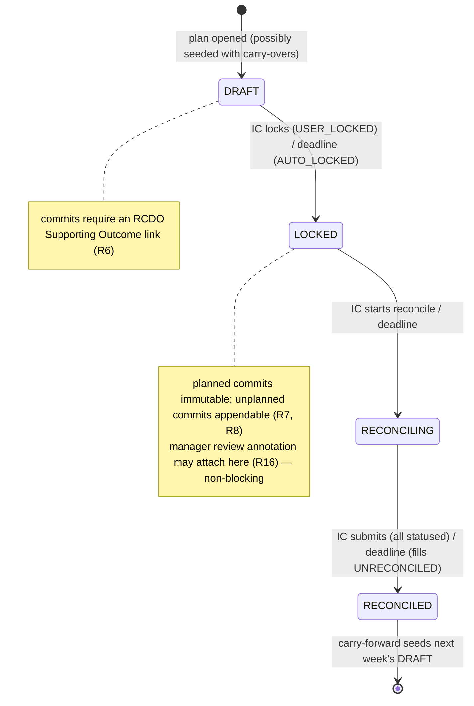
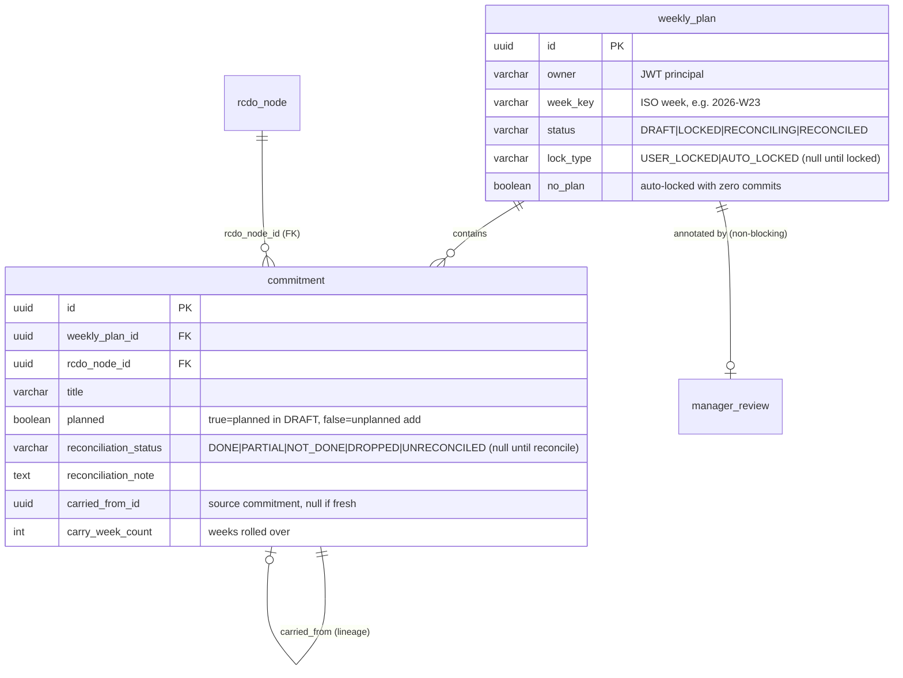

# feat: Weekly Lifecycle Engine (Workstream C)

## Summary

Build the backend weekly lifecycle: a per-IC, per-week plan that moves through `DRAFT → LOCKED → RECONCILING → RECONCILED`, with weekly commitments that must link to an RCDO Supporting Outcome, locked plans that are immutable but appendable, a structured reconciliation pass, deadline backstops that auto-advance every forward transition, and carry-forward that seeds the next week's draft with unfinished work.

This is the enforcement core of the product (see origin: `docs/brainstorms/weekly-lifecycle-state-machine-requirements.md`). The strategic link and the weekly close are **structural properties of the lifecycle**, not optional fields. Backend only — IC screens are workstream D, the manager dashboard is workstream F. This plan produces the lifecycle engine and the data those surfaces consume, including the non-blocking manager-review annotation and the two-axis reconciliation metrics.

---

## Problem Frame

Weekly planning and strategic execution live in two disconnected systems; nothing forces an IC's commitments to map to a Supporting Outcome, and nothing forces the week to close. Misalignment stays invisible until a manager reconstructs it by hand. The lifecycle is where enforcement happens: if states are advisory and plans can drift to match reality, the system degrades back into 15Five. The hard part is making the strategic link and the weekly close enforced by the state machine rather than by people remembering.

Workstreams A (platform) and B (RCDO hierarchy) are merged to `main`. B exposes a single `rcdo_node` table with UUID ids and `GET /api/rcdo/nodes/{id}` — exactly the link target this engine validates against.

---

## Scope Boundaries

### In scope
- `WeeklyPlan` entity (per IC, per ISO week) with a lifecycle `status` and transition provenance.
- `Commitment` entity linked to an RCDO node via a single `rcdo_node_id` FK; planned vs. unplanned; reconciliation status + note; carry-over lineage (week-count, source commitment).
- The state machine: manual transitions (`DRAFT→LOCKED`, `LOCKED→RECONCILING`, `RECONCILING→RECONCILED`) with validation, plus a `@Scheduled` deadline backstop that auto-advances all three forward transitions.
- RCDO-link enforcement at commitment entry (R6); post-lock immutability of planned commitments with appendable `unplanned` commitments (R7, R8).
- Reconciliation: per-commit status (`DONE`/`PARTIAL`/`NOT_DONE`/`DROPPED`, plus system-applied `UNRECONCILED`), submit-gated `RECONCILING→RECONCILED` (R9, R10, R19).
- Carry-forward as a seeding action: at `RECONCILED`, `PARTIAL`/`NOT_DONE` planned commits become IC-selected carry candidates pre-linked to their Outcome, with history + week-count (R12–R15).
- Two-axis metrics computed from reconciliation data: reconciliation-accuracy (planned only) and planned-vs-unplanned ratio (R11).
- Non-blocking manager-review annotation (reviewer, timestamp, comment) that never gates a transition (R16, R17).
- JWT-secured REST endpoints under `/api/lifecycle` (or per-resource paths) for the IC actions an agent or workstream-D UI will drive.
- An injected `java.time.Clock` so deadline logic is unit-testable.

### Deferred to Follow-Up Work
- **Multi-instance scheduler safety (ShedLock/Quartz).** Plain `@Scheduled` is single-instance (see KTD 6). If the deployment ever runs >1 backend instance, add a distributed lock so only one instance fires the sweep. Out of scope for a single-instance assessment build.
- **Configurable deadline calendar.** Exact lock/reconcile day-and-time values and the org cadence calendar are configuration, not lifecycle shape (origin: Scope Boundaries). This plan reads deadlines from config with sane defaults; the admin UI to manage them is later.
- Notifications/reminders around deadlines (origin: Scope Boundaries — adjacent, deferrable).

### Outside this product's identity (carried from origin Scope Boundaries)
- Manager dashboard / team roll-up **UI** (workstream F) — this engine produces the data, not the visualization.
- The "chess layer" categorization/prioritization mechanism (separate concern, workstream E).
- RCDO hierarchy **management** (create/edit Rally Cries etc.) — the lifecycle consumes the hierarchy; workstream B owns it read-only and management is a later workstream.
- Outlook Graph / calendar integration.

---

## Requirements Traceability

Origin requirements R1–R19 and acceptance examples AE1–AE9 map to units as follows. The brainstorm's R-numbers are the acceptance contract — not re-decided here.

| Requirement | Theme | Unit(s) |
|---|---|---|
| R1 | 5 states per IC/week (Carry Forward = seeding action, KTD 1) | U1 |
| R2, R3, R18 | Hybrid manual + deadline-backstop transitions | U4, U7 |
| R4 | Transition provenance (`user-locked`/`auto-locked`) | U1, U4 |
| R5 | Empty draft locks as distinct "no plan" outcome | U4 |
| R6 | Commit requires Supporting Outcome link at entry | U3 |
| R7, R8 | Locked plan immutable, appendable `unplanned` commits | U3, U4 |
| R9, R10 | Per-commit reconciliation status + submit gate | U5 |
| R11 | Two-axis metrics (accuracy excl. unplanned; reactive ratio) | U6 |
| R12–R15 | Carry-forward (IC-selected, excl. Dropped, history + week-count) | U8 |
| R16, R17 | Non-blocking manager-review annotation | U9 |
| R19 | Auto-close records `UNRECONCILED`, never `Done` | U5, U7 |
| AE1–AE9 | Acceptance examples | mapped per-unit in Test scenarios |

---

## Key Technical Decisions

### KTD 1 — "Carry Forward" is a seeding action, not a persisted 5th state

Persisted `WeeklyPlan.status` has four values: `DRAFT`, `LOCKED`, `RECONCILING`, `RECONCILED`. "Carry Forward" (origin R1) is modeled as the **seeding operation** performed at/after `RECONCILED` that creates the next week's `DRAFT` populated with IC-selected carried commitments — resolving origin Outstanding Question (a).

**Why:** Carry-forward is a cross-week handoff *moment*, not a stable status a plan sits in. A plan never rests in "Carry Forward" — it reaches `RECONCILED` and its unfinished commitments flow into the *next* plan's `DRAFT`. Modeling it as a fifth status would create a state with no stable occupancy and force awkward "which week's plan is in Carry Forward" questions. A seeding action keeps the status enum honest (each value is a real resting state) and matches the actual data flow. The brainstorm explicitly defers this to planning.

### KTD 2 — Status enum carries the state; provenance + outcome distinctions are separate columns

`WeeklyPlan` holds `status` (the four-value enum) plus `lock_type` (`USER_LOCKED` / `AUTO_LOCKED`, nullable until locked) and a derived/stored `no_plan` signal (an auto-locked plan with zero commitments). This resolves origin Outstanding Question (b): provenance and the "no plan" outcome are first-class columns both managers (workstream F) and metrics (U6) read directly, not buried in status.

**Why:** R4/R5 require the `user-locked` vs `auto-locked` and "no plan submitted" distinctions to be consumable by both managers and metrics. Overloading the status enum (e.g. a `AUTO_LOCKED_NO_PLAN` status) would explode the enum and entangle "what state" with "how it got there." Separate columns keep each axis queryable.

### KTD 3 — Commitment links to RCDO via a single `rcdo_node_id` UUID column (plain column, DB FK), mirroring workstream B

`Commitment` holds `@Column(name = "rcdo_node_id") private UUID rcdoNodeId;` — a plain UUID with a DB-level FK to `rcdo_node(id)` and an index, **not** a `@ManyToOne`. This is exactly how `RcdoNode.parentId` is modeled (workstream B, KTD 1) and the single-FK link target B was built to provide. Link existence is validated in the service via the RCDO repository before save (R6).

**Why:** Consistency with the established repo convention (no JPA associations anywhere), avoids lazy-loading N+1, and uses the single-FK design B deliberately enabled. Validating "is this a real Supporting Outcome" is a service-layer check, not a mapping concern.

### KTD 4 — Immutability is enforced in the service layer by commitment flag + plan status, not by DB triggers

Once a plan is `LOCKED`, planned commitments (those created in `DRAFT`) are immutable: the service rejects edit/delete of any commitment whose `planned` flag is true on a plan past `DRAFT`. New commitments added to a `LOCKED` plan are accepted, flagged `unplanned`, and still require an Outcome link (R7, R8).

**Why:** The immutability rule is conditional (planned vs unplanned, gated on plan status) — exactly the kind of business rule the service layer owns. DB triggers would hide the rule from the code and complicate testing. The flag-based approach matches the brainstorm's "field-level/by-flag, not whole-entity" framing.

### KTD 5 — Reconciliation status is a per-commitment enum including a system-only `UNRECONCILED`

`Commitment.reconciliationStatus` is nullable until reconciliation, then one of `DONE`, `PARTIAL`, `NOT_DONE`, `DROPPED` (IC-set) or `UNRECONCILED` (system-set only, on backstop auto-close). The submit gate (`RECONCILING→RECONCILED`) requires every commitment to have an IC-set status; the backstop fills any remaining nulls with `UNRECONCILED` (R9, R10, R19).

**Why:** R19 demands auto-closed weeks stay honest — unstatused commits must be visibly `UNRECONCILED`, never silently `Done`. Making it a distinct enum value (vs a separate boolean) keeps the reconciliation outcome single-sourced and lets metrics exclude or flag it explicitly.

### KTD 6 — Deadline backstop is a single `@Scheduled` sweep over all three forward transitions; time comes from an injected `Clock`

One `@Scheduled` method (with `@EnableScheduling`) runs periodically and sweeps **all three** forward transitions (R18): auto-lock overdue `DRAFT`s, auto-advance overdue `LOCKED`s to `RECONCILING`, auto-close overdue `RECONCILING`s to `RECONCILED` (applying `UNRECONCILED`). All deadline math uses an injected `java.time.Clock` bean so tests advance time deterministically. Plain Spring `@Scheduled`, single-instance (multi-instance safety deferred — see Scope Boundaries).

**Why:** R18 is explicit that *every* forward edge has a backstop, not just lock — the single most easily-missed scoping point (flagged by research). One sweep method keeps the logic together. The repo has no scheduling or `Clock` precedent, so this establishes both; injecting `Clock` is what makes the deadline logic unit-testable without real waiting.

### KTD 7 — "The week" is an org-wide ISO week key; plan identity is (principal, weekKey)

A `WeeklyPlan` is uniquely identified by its owner (the JWT principal, via the existing `PrincipalResolver`) and an ISO-8601 week key (e.g. `2026-W23`), with a unique constraint on `(owner, week_key)`. Per origin Dependencies/Assumptions, the week is a fixed org-wide cycle, not per-user custom periods.

**Why:** Gives a deterministic plan identity, makes "this IC's plan for this week" a single lookup, and makes carry-forward's "next week's draft" a simple week-key increment. Reuses the existing `PrincipalResolver` seam (research: the established way to get the current principal) rather than introducing a parallel user-identity path. Whether to map the raw JWT `sub` to a user record is noted as a deferred refinement (origin A/B anticipated this swap), not required for C.

---

## High-Level Technical Design

*This illustrates the intended approach and is directional guidance for review, not implementation specification. The implementing agent should treat it as context, not code to reproduce.*

### Lifecycle state machine



Every forward edge has both a manual trigger and a deadline backstop (R2, R18). The backstop sweep applies `AUTO_LOCKED` / `UNRECONCILED` provenance so auto-driven progress stays distinguishable from IC action.

### Entity shape (directional)



---

## Output Structure

New backend files (repo-relative). New feature package `com.weeklycommit.lifecycle` mirroring `rcdo/`:

```
backend/src/main/java/com/weeklycommit/lifecycle/
    WeeklyPlan.java                 # entity (U1)
    PlanStatus.java                 # enum DRAFT|LOCKED|RECONCILING|RECONCILED (U1)
    LockType.java                   # enum USER_LOCKED|AUTO_LOCKED (U1)
    Commitment.java                 # entity (U2)
    ReconciliationStatus.java       # enum incl. UNRECONCILED (U2)
    WeeklyPlanRepository.java       # (U1)
    CommitmentRepository.java       # (U2)
    LifecycleService.java           # state machine + transition validation (U4)
    CommitmentService.java          # commit CRUD + RCDO-link + immutability (U3)
    ReconciliationService.java      # status + submit gate (U5)
    CarryForwardService.java        # seeding action (U8)
    MetricsService.java             # two-axis metrics (U6)
    DeadlineBackstopJob.java        # @Scheduled sweep (U7)
    ManagerReview.java              # annotation entity (U9)
    ManagerReviewService.java       # (U9)
    LifecycleController.java        # plan/transition endpoints (U4)
    CommitmentController.java       # commit endpoints (U3)
    ReconciliationController.java   # reconcile endpoints (U5)
    CarryForwardController.java     # carry endpoints (U8)
    ManagerReviewController.java    # review endpoint (U9)
    *Dto.java                       # response records per resource
backend/src/main/java/com/weeklycommit/config/
    ClockConfig.java                # Clock bean (U0)
    SchedulingConfig.java           # @EnableScheduling (U7)
backend/src/main/resources/db/migration/
    V4__weekly_plan_and_commitment.sql   # tables (U1, U2)
    V5__manager_review.sql               # review annotation table (U9)
backend/src/test/java/com/weeklycommit/lifecycle/
    ... mirrored unit + IT tests per unit
```

Per-unit `**Files:**` are authoritative; this tree is the scope overview.

---

## Implementation Units

### U0. Inject a testable Clock

**Goal:** A `java.time.Clock` bean exists and is the single source of "now" for all lifecycle/deadline logic, so tests control time.

**Requirements:** Enables R2/R18 testing; foundation for U4–U8.

**Dependencies:** none.

**Files:**
- `backend/src/main/java/com/weeklycommit/config/ClockConfig.java` (create)
- `backend/src/test/java/com/weeklycommit/lifecycle/support/FixedClockConfig.java` (create — test config supplying a mutable/fixed Clock)

**Approach:** Provide `@Bean Clock systemClock()` returning `Clock.systemUTC()`. All services that compute deadlines inject `Clock` and call `Instant.now(clock)`. Tests `@Import` a config supplying a fixed/adjustable Clock (mirror the `@Import(TestPrincipalConfig)` override pattern). Note: wiring Spring auditing's `DateTimeProvider` to this Clock is optional and out of scope — auditing already works.

**Patterns to follow:**
- Bean config style: `backend/src/main/java/com/weeklycommit/config/CorsConfig.java`, `JpaAuditingConfig.java`
- Test override pattern: `backend/src/test/java/com/weeklycommit/support/TestPrincipalConfig.java`

**Test scenarios:** `Test expectation: none -- pure bean wiring; exercised indirectly by U4/U7 deadline tests via the fixed-clock override.`

**Verification:** A test can inject a fixed `Clock`, advance it, and observe deadline logic react; `./gradlew check` green.

---

### U1. WeeklyPlan entity, status/lock enums, repository, migration

**Goal:** The `weekly_plan` table exists, matches the entity (ddl-auto: validate), and is uniquely keyed by (owner, week_key).

**Requirements:** R1, R4, R5 (storage); KTD 1, 2, 7.

**Dependencies:** none (sibling to U0).

**Files:**
- `backend/src/main/java/com/weeklycommit/lifecycle/WeeklyPlan.java` (create)
- `backend/src/main/java/com/weeklycommit/lifecycle/PlanStatus.java` (create — `DRAFT, LOCKED, RECONCILING, RECONCILED`)
- `backend/src/main/java/com/weeklycommit/lifecycle/LockType.java` (create — `USER_LOCKED, AUTO_LOCKED`)
- `backend/src/main/java/com/weeklycommit/lifecycle/WeeklyPlanRepository.java` (create)
- `backend/src/main/resources/db/migration/V4__weekly_plan_and_commitment.sql` (create — `weekly_plan` portion; commitment table added in U2, same migration file)
- `backend/src/test/java/com/weeklycommit/lifecycle/WeeklyPlanRepositoryTest.java` (create)
- `backend/src/test/java/com/weeklycommit/lifecycle/LifecycleMigrationTest.java` (create)

**Approach:** `WeeklyPlan extends AbstractAuditingEntity`, UUID id (`gen_random_uuid()`), class-level `@Getter @Setter`. Columns: `owner` (varchar, the principal), `week_key` (varchar, ISO week), `status` (`@Enumerated(STRING)`, length 16), `lock_type` (`@Enumerated(STRING)`, length 16, nullable), `no_plan` (boolean, default false). Unique constraint `(owner, week_key)`. Repository: `findByOwnerAndWeekKey`, `findByStatusAndStatusDeadlineBefore`-style finders for the backstop (deadline column TBD in U4/U7 — see deferred note). Migration uses `TIMESTAMPTZ` audit columns and `VARCHAR(n)` enum columns per the B convention.

**Patterns to follow:**
- Entity: `backend/src/main/java/com/weeklycommit/rcdo/RcdoNode.java`
- Enum: `backend/src/main/java/com/weeklycommit/rcdo/RcdoNodeType.java`
- Repository: `backend/src/main/java/com/weeklycommit/rcdo/RcdoNodeRepository.java`
- Migration + audit columns + drift-guard test: `backend/src/main/resources/db/migration/V2__rcdo_tables.sql`, `backend/src/test/java/com/weeklycommit/rcdo/RcdoMigrationTest.java`
- IT base / `@Transactional` count-test pattern: `backend/src/test/java/com/weeklycommit/rcdo/RcdoNodeRepositoryTest.java`

**Test scenarios:**
- Migration applied + `validate` context loads (drift guard) — mirror `RcdoMigrationTest`.
- Saving a plan populates audit fields from the principal (`@Import(TestPrincipalConfig)`).
- `(owner, week_key)` uniqueness: saving a second plan with the same owner+week violates the constraint (assert `DataIntegrityViolationException`).
- `findByOwnerAndWeekKey` returns the plan for that owner/week and not another owner's.

**Verification:** `./gradlew check` green; repository finders behave against embedded Postgres.

---

### U2. Commitment entity, reconciliation enum, repository (same V4 migration)

**Goal:** The `commitment` table exists, links to `weekly_plan` and `rcdo_node`, and carries planned/unplanned + reconciliation + carry-lineage fields.

**Requirements:** R6, R8, R9, R11, R12–R15 (storage); KTD 3, 4, 5.

**Dependencies:** U1 (FK to weekly_plan).

**Files:**
- `backend/src/main/java/com/weeklycommit/lifecycle/Commitment.java` (create)
- `backend/src/main/java/com/weeklycommit/lifecycle/ReconciliationStatus.java` (create — `DONE, PARTIAL, NOT_DONE, DROPPED, UNRECONCILED`)
- `backend/src/main/java/com/weeklycommit/lifecycle/CommitmentRepository.java` (create)
- `backend/src/main/resources/db/migration/V4__weekly_plan_and_commitment.sql` (modify — add `commitment` table)
- `backend/src/test/java/com/weeklycommit/lifecycle/CommitmentRepositoryTest.java` (create)

**Approach:** `Commitment extends AbstractAuditingEntity`, UUID id. Columns: `weekly_plan_id` (UUID, FK, indexed), `rcdo_node_id` (UUID, FK to `rcdo_node`, indexed — KTD 3), `title` (varchar), `planned` (boolean), `reconciliation_status` (`@Enumerated(STRING)`, length 16, nullable), `reconciliation_note` (text, nullable), `carried_from_id` (UUID self-FK, nullable), `carry_week_count` (int, default 0). Repository: `findByWeeklyPlanId`, `findByWeeklyPlanIdAndPlanned`, counts for metrics.

**Patterns to follow:** same as U1; self-FK pattern from `RcdoNode.parentId` + `V2` `REFERENCES`.

**Test scenarios:**
- Persist a commitment with a valid `weekly_plan_id` + `rcdo_node_id`; read back the FK values.
- `rcdo_node_id` referencing a non-existent node violates the FK (assert `DataIntegrityViolationException`) — proves the link integrity KTD 3 relies on.
- `weekly_plan_id` referencing a missing plan violates its FK.
- `findByWeeklyPlanIdAndPlanned(planId, true)` returns only planned commitments.
- Audit fields populated on save.

**Verification:** `./gradlew check` green; FK integrity enforced both directions.

---

### U3. Commitment service + controller: RCDO-link enforcement and post-lock immutability

**Goal:** ICs can add/edit/delete commitments through `/api/...`, but only legally: every commitment requires a valid Supporting Outcome link, and planned commitments are immutable once the plan leaves `DRAFT`.

**Requirements:** R6, R7, R8. Covers AE3, AE4.

**Dependencies:** U1, U2.

**Files:**
- `backend/src/main/java/com/weeklycommit/lifecycle/CommitmentService.java` (create)
- `backend/src/main/java/com/weeklycommit/lifecycle/CommitmentController.java` (create)
- `backend/src/main/java/com/weeklycommit/lifecycle/CommitmentDto.java` (create)
- `backend/src/test/java/com/weeklycommit/lifecycle/CommitmentServiceTest.java` (create)
- `backend/src/test/java/com/weeklycommit/lifecycle/CommitmentControllerTest.java` (create)

**Approach:** `CommitmentService` injects `CommitmentRepository`, `WeeklyPlanRepository`, and `RcdoNodeRepository` (from workstream B). On create: reject if `rcdoNodeId` is null or not found in `rcdo_node` (R6); if the plan is `DRAFT`, flag `planned=true`; if `LOCKED`, flag `planned=false` (unplanned, R8); reject adds when the plan is past `LOCKED` (reconciling/reconciled). On edit/delete: reject if the target commitment is `planned` and the plan is not `DRAFT` (R7). Validation failures throw a 4xx via `ResponseStatusException` (409/422 for illegal-state, 400 for missing link). Controller mirrors `RcdoController` shape; ownership: the plan must belong to the current principal (`PrincipalResolver`).

**Execution note:** Start with failing `CommitmentControllerTest` cases for the AE3/AE4 contract (reject unlinked save; reject planned-edit on locked; accept unplanned-add on locked) before wiring the service.

**Patterns to follow:**
- Controller/service/DTO: `backend/src/main/java/com/weeklycommit/rcdo/RcdoController.java`, `RcdoService.java`, `RcdoNodeDto.java`
- RCDO existence check: `RcdoNodeRepository.findById`/`existsById`
- 404/4xx: `ResponseStatusException` as in `RcdoController`
- Auth test: `backend/src/test/java/com/weeklycommit/rcdo/RcdoControllerTest.java`, `support/TestSecurityConfig.java`

**Test scenarios:**
- `Covers AE3.` Creating a commitment with no `rcdoNodeId` → rejected, nothing persisted.
- Creating a commitment with an `rcdoNodeId` that doesn't exist in `rcdo_node` → rejected.
- Creating on a `DRAFT` plan → persisted with `planned=true`.
- `Covers AE4.` On a `LOCKED` plan: editing/deleting a `planned` commitment → rejected; adding a new commitment → accepted with `planned=false` (still requires a valid link).
- Adding a commitment on a `RECONCILING`/`RECONCILED` plan → rejected.
- Endpoint without a JWT → 401 (secured-by-default).
- A principal acting on another owner's plan → 403/404 (ownership enforced).

**Verification:** AE3 and AE4 pass at the HTTP level; immutability and link rules hold; coverage keeps `check` ≥80%.

---

### U4. Lifecycle service + controller: manual transitions, provenance, "no plan"

**Goal:** ICs can advance their plan through the states manually, with each transition validated; provenance and the empty-plan outcome are recorded.

**Requirements:** R2, R3, R4, R5, R7. Covers AE2 (manual portion), supports AE1/AE8.

**Dependencies:** U1, U3.

**Files:**
- `backend/src/main/java/com/weeklycommit/lifecycle/LifecycleService.java` (create)
- `backend/src/main/java/com/weeklycommit/lifecycle/LifecycleController.java` (create)
- `backend/src/main/java/com/weeklycommit/lifecycle/WeeklyPlanDto.java` (create)
- `backend/src/test/java/com/weeklycommit/lifecycle/LifecycleServiceTest.java` (create)
- `backend/src/test/java/com/weeklycommit/lifecycle/LifecycleControllerTest.java` (create)

**Approach:** `LifecycleService` owns the transition table: only legal forward transitions are allowed (`DRAFT→LOCKED→RECONCILING→RECONCILED`); any illegal transition (skip, backward) throws a 409. Manual lock sets `lock_type=USER_LOCKED`; if the plan has zero commitments at lock, set `no_plan=true` (R5). Expose endpoints to fetch the current plan (get-or-create `DRAFT` for the principal's current week) and to request each manual transition. Reconcile-submit is delegated to U5's `ReconciliationService` but the `RECONCILING→RECONCILED` legality lives here. Store the per-state deadline (a column or computed from `week_key` + config) so U7's backstop can find overdue plans — exact representation is a deferred implementation detail.

**Patterns to follow:** controller/service/DTO as U3; enum-driven transition validation is new logic (no repo precedent) — keep it a single explicit allowed-transitions map.

**Test scenarios:**
- Get-or-create returns a `DRAFT` plan for the principal's current week; second call returns the same plan (idempotent).
- Manual `DRAFT→LOCKED` sets `status=LOCKED`, `lock_type=USER_LOCKED`.
- Locking a plan with zero commitments sets `no_plan=true` and still locks (manual analogue of AE2).
- Illegal transition (`DRAFT→RECONCILED`, or backward `LOCKED→DRAFT`) → 409, no change.
- Legal `LOCKED→RECONCILING` succeeds.
- Transition on another owner's plan → 403/404.
- Endpoint without JWT → 401.

**Verification:** Manual state machine enforces legal transitions and records provenance; illegal transitions rejected.

---

### U5. Reconciliation service + controller: per-commit status and submit gate

**Goal:** In `RECONCILING`, ICs status each commitment; the plan advances to `RECONCILED` only when all are statused.

**Requirements:** R9, R10, R19 (the IC-set portion). Covers AE5.

**Dependencies:** U2, U4.

**Files:**
- `backend/src/main/java/com/weeklycommit/lifecycle/ReconciliationService.java` (create)
- `backend/src/main/java/com/weeklycommit/lifecycle/ReconciliationController.java` (create)
- `backend/src/test/java/com/weeklycommit/lifecycle/ReconciliationServiceTest.java` (create)
- `backend/src/test/java/com/weeklycommit/lifecycle/ReconciliationControllerTest.java` (create)

**Approach:** Endpoint to set a commitment's `reconciliation_status` (one of the IC-settable values `DONE/PARTIAL/NOT_DONE/DROPPED`) + optional note; only allowed while the plan is `RECONCILING`. Submit endpoint checks every commitment (planned and unplanned) has a non-null IC-set status; if any is unstatused, reject submit (R10) — do not advance. On success, transition `RECONCILING→RECONCILED`. The system-only `UNRECONCILED` value is never settable via this endpoint (only U7 sets it).

**Execution note:** Start with a failing test for AE5 (submit blocked when one commit unstatused) before wiring the gate.

**Patterns to follow:** service/controller as U3/U4.

**Test scenarios:**
- `Covers AE5.` Plan in `RECONCILING`, one commitment unstatused → submit rejected, stays `RECONCILING`.
- All commitments statused → submit advances to `RECONCILED`.
- Setting status on a commitment while plan is `LOCKED` (not yet reconciling) → rejected.
- Attempting to set `UNRECONCILED` via the IC endpoint → rejected (system-only).
- Setting a status + note persists both; note is optional.
- Without JWT → 401; other owner → 403/404.

**Verification:** AE5 passes; submit gate holds; `UNRECONCILED` not IC-settable.

---

### U6. Metrics service: two-axis reconciliation signals

**Goal:** Compute reconciliation-accuracy (planned commitments only) and the planned-vs-unplanned ratio from a reconciled plan.

**Requirements:** R11. Covers AE6.

**Dependencies:** U2, U5.

**Files:**
- `backend/src/main/java/com/weeklycommit/lifecycle/MetricsService.java` (create)
- `backend/src/main/java/com/weeklycommit/lifecycle/PlanMetricsDto.java` (create)
- `backend/src/main/java/com/weeklycommit/lifecycle/LifecycleController.java` (modify — add a metrics endpoint, or a dedicated controller)
- `backend/src/test/java/com/weeklycommit/lifecycle/MetricsServiceTest.java` (create)

**Approach:** `MetricsService` computes, for a plan: reconciliation-accuracy = (planned commitments marked `DONE`) / (total planned commitments), explicitly excluding unplanned commitments and treating `UNRECONCILED` as not-done; planned-vs-unplanned ratio = unplanned count / planned count (or both raw counts in the DTO so the consumer can render either). Pure computation over `CommitmentRepository` results — unit-testable without HTTP.

**Patterns to follow:** in-memory aggregation over a single repository query, like `RcdoService.getTree`'s assembly; DTO record.

**Test scenarios:**
- `Covers AE6.` 4 planned (3 `DONE`) + 2 unplanned → accuracy = 0.75 computed from the 4 planned only; unplanned contributes to the ratio, not accuracy.
- A planned commitment marked `UNRECONCILED` counts against accuracy (not as done).
- Zero planned commitments → accuracy is defined (0 or null per chosen convention — assert the chosen one), no divide-by-zero.
- Ratio reflects unplanned/planned counts.

**Verification:** AE6 passes; metrics derive purely from reconciliation data (success criterion).

---

### U7. Deadline backstop: @Scheduled sweep over all three forward transitions

**Goal:** A scheduled job auto-advances any plan whose actor missed the deadline, on every forward edge, recording auto-provenance and `UNRECONCILED`.

**Requirements:** R2, R18, R19, R4, R5. Covers AE1, AE9.

**Dependencies:** U0 (Clock), U4 (transition logic), U5 (reconcile transition).

**Files:**
- `backend/src/main/java/com/weeklycommit/lifecycle/DeadlineBackstopJob.java` (create)
- `backend/src/main/java/com/weeklycommit/config/SchedulingConfig.java` (create — `@EnableScheduling`)
- `backend/src/test/java/com/weeklycommit/lifecycle/DeadlineBackstopJobTest.java` (create)

**Approach:** A single `@Scheduled(fixedDelayString = ...)` method (or invokable sweep method the test calls directly) that, using the injected `Clock`: (1) finds `DRAFT` plans past their lock deadline → lock them `AUTO_LOCKED`, set `no_plan` if empty (R5); (2) finds `LOCKED` plans past their reconcile-start deadline → advance to `RECONCILING`; (3) finds `RECONCILING` plans past their reconcile deadline → set any unstatused commitment to `UNRECONCILED` and advance to `RECONCILED` (R19). Reuse `LifecycleService`/`ReconciliationService` transition methods so manual and auto paths share validation. Tests invoke the sweep method directly with a fixed Clock (don't rely on the scheduler firing).

**Execution note:** Test-first against AE1 and AE9 with a fixed, advanceable Clock.

**Patterns to follow:** services from U4/U5; `Clock` from U0; bean config like `JpaAuditingConfig`. No scheduling precedent in repo — this establishes it.

**Test scenarios:**
- `Covers AE1.` `DRAFT` with two linked commits, clock advanced past lock deadline → swept to `LOCKED`, `lock_type=AUTO_LOCKED`.
- `Covers AE2.` Empty `DRAFT` past deadline → `LOCKED`, `no_plan=true`.
- `LOCKED` past reconcile-start deadline → `RECONCILING`.
- `Covers AE9.` `RECONCILING` with 2 of 4 commitments statused, past reconcile deadline → `RECONCILED`; the 2 unstatused → `UNRECONCILED` (not `DONE`); the 2 IC-set statuses unchanged.
- A plan not past its deadline is untouched by the sweep.
- A plan already `RECONCILED` is ignored.

**Verification:** AE1, AE2 (auto), AE9 pass with deterministic time; no plan can stall mid-lifecycle.

---

### U8. Carry-forward: seed next week's draft (seeding action, KTD 1)

**Goal:** At/after `RECONCILED`, offer `PARTIAL`/`NOT_DONE` planned commitments as IC-selected carry candidates and seed them into the next week's `DRAFT` with lineage.

**Requirements:** R12, R13, R14, R15. Covers AE7.

**Dependencies:** U1, U2, U5.

**Files:**
- `backend/src/main/java/com/weeklycommit/lifecycle/CarryForwardService.java` (create)
- `backend/src/main/java/com/weeklycommit/lifecycle/CarryForwardController.java` (create)
- `backend/src/main/java/com/weeklycommit/lifecycle/CarryCandidateDto.java` (create)
- `backend/src/test/java/com/weeklycommit/lifecycle/CarryForwardServiceTest.java` (create)
- `backend/src/test/java/com/weeklycommit/lifecycle/CarryForwardControllerTest.java` (create)

**Approach:** Endpoint to list carry candidates for a `RECONCILED` plan: planned commitments with status `PARTIAL` or `NOT_DONE` (R12), excluding `DROPPED` (R15). Endpoint to carry a selected subset into the next week's `DRAFT` (get-or-create via `LifecycleService` for `owner` + next `week_key`): each carried commitment is a new `Commitment` in the new plan, `planned=true`, pre-linked to the same `rcdo_node_id` (R12), `carried_from_id` = source commitment, `carry_week_count` = source's count + 1 (R14). IC selects which — never automatic (R13).

**Patterns to follow:** services/controllers as prior units; week-key increment helper (new, small).

**Test scenarios:**
- `Covers AE7.` `RECONCILED` plan with one `PARTIAL`, one `NOT_DONE`, one `DROPPED`: candidates list = the `PARTIAL` + `NOT_DONE`, not the `DROPPED`.
- Carrying selected candidates creates them in next week's `DRAFT`, `planned=true`, same `rcdo_node_id`, `carry_week_count` incremented, `carried_from_id` set.
- A commitment carried across two weeks shows `carry_week_count=2`.
- Carrying from a non-`RECONCILED` plan → rejected.
- Only IC-selected candidates are carried (unselected are not) — proves R13.
- Without JWT → 401; other owner → 403/404.

**Verification:** AE7 passes; lineage and week-count preserved; `DROPPED` never offered.

---

### U9. Manager-review annotation (non-blocking overlay)

**Goal:** A manager can attach a review (reviewer, timestamp, comment) to a plan; it never gates a transition.

**Requirements:** R16, R17. Covers AE8.

**Dependencies:** U1, U4.

**Files:**
- `backend/src/main/java/com/weeklycommit/lifecycle/ManagerReview.java` (create — entity)
- `backend/src/main/java/com/weeklycommit/lifecycle/ManagerReviewService.java` (create)
- `backend/src/main/java/com/weeklycommit/lifecycle/ManagerReviewController.java` (create)
- `backend/src/main/java/com/weeklycommit/lifecycle/ManagerReviewDto.java` (create)
- `backend/src/main/resources/db/migration/V5__manager_review.sql` (create)
- `backend/src/test/java/com/weeklycommit/lifecycle/ManagerReviewServiceTest.java` (create)
- `backend/src/test/java/com/weeklycommit/lifecycle/ManagerReviewControllerTest.java` (create)

**Approach:** Separate `manager_review` table (resolves origin Outstanding Question (c): the annotation lives in its own entity referencing `weekly_plan_id`, so it never touches the immutable plan/commitments). Columns: `weekly_plan_id` (FK), `reviewer` (principal), `comment` (text, nullable), plus audit timestamps. Endpoint to create/update a review for a plan. Crucially, the lifecycle transition logic (U4/U7) does **not** consult reviews — verified by an AE8 test that advances a plan with no review.

**Patterns to follow:** entity/migration/service/controller as prior units.

**Test scenarios:**
- `Covers AE8.` A `LOCKED` plan with no manager review advances to `RECONCILING` successfully (review status never gates the transition).
- Creating a review persists reviewer, comment, timestamp against the plan.
- A review can be added at `LOCKED` (its primary touchpoint, R16) and does not mutate the plan or its commitments.
- Review is optional — its absence is a valid state through the whole lifecycle.
- Without JWT → 401.

**Verification:** AE8 passes; reviews are a pure overlay; transitions are review-independent.

---

## System-Wide Impact

- **Workstream D (IC screens)** will drive these endpoints — the controllers are the contract D builds against. Keep DTO shapes clean and documented.
- **Workstream F (manager dashboard)** consumes `WeeklyPlan` provenance columns (`lock_type`, `no_plan`), the metrics from U6, and the `manager_review` annotation from U9.
- **Workstream B (RCDO)** is consumed read-only: `CommitmentService` validates `rcdo_node_id` against `RcdoNodeRepository`. No B code changes.
- **New global conventions established:** an injected `Clock` (U0) and `@Scheduled` infrastructure (U7) — the first in the repo. Both are strong `/ce-compound` capture candidates after merge.
- **Migrations V4/V5** are the first domain tables beyond RCDO; once merged they are immutable history.
- **Coverage:** all new `lifecycle` classes count toward the JaCoCo 80% line gate; entities/DTOs are Lombok/record-generated (effectively excluded), so the service/controller/job logic must be covered by the enumerated tests.

---

## Risks & Mitigations

| Risk | Mitigation |
|---|---|
| Entity↔migration drift fails `validate` at startup | `LifecycleMigrationTest` (U1) asserts validate-passing context load |
| Deadline logic untestable without real waiting | Injected `Clock` (U0); backstop sweep is a directly-invokable method tests call with a fixed clock (U7) |
| Backstop only handling lock (missing R18's other two edges) | KTD 6 + U7 explicitly sweep all three forward transitions; AE9 test covers the reconcile edge |
| Auto-close silently marking work `Done` | `UNRECONCILED` is a distinct system-only enum value never IC-settable (KTD 5); AE9 asserts it |
| Immutability rule leaking or inconsistent | Centralized in `CommitmentService` (KTD 4), gated on plan status + `planned` flag; AE4 test |
| Multi-instance double-firing the sweep | Single-instance assumption documented; ShedLock deferred (Scope Boundaries) — not a correctness risk for the assessment's single instance |
| Carry-forward duplicating or losing lineage | `carried_from_id` + `carry_week_count` explicit; AE7 + two-week test |
| Ownership bugs (acting on another IC's plan) | Every mutating endpoint checks plan owner == current principal; per-unit 403/404 tests |

---

## Verification Strategy

- **Backend:** `cd backend && JAVA_HOME=<JDK21> ./gradlew check` — runs all lifecycle unit + IT tests against embedded Postgres, plus Spotless, SpotBugs, `checkNoLombokData`, and the JaCoCo 80% line gate. (Host JDK 25 breaks Gradle 8.10.2; use the pinned JDK 21 — inherited build note from A/B.)
- **Acceptance examples:** AE1–AE9 are each pinned to a named test scenario above; all nine passing is the functional bar.
- **No frontend in this workstream** — RTK Query endpoints for these APIs land with workstream D's screens.
- **Deferred to G:** Cypress E2E for the full lifecycle flow belongs to the E2E suite workstream.

---

## Deferred Implementation Notes

- **Exact deadline representation:** whether each plan stores per-state deadline timestamps, or the backstop computes them from `week_key` + configured offsets. Decide at U4/U7 implementation; keep it `Clock`-driven either way. The brainstorm defers exact deadline *values* as configuration.
- **Week-key format + increment helper:** ISO-week string vs (year, week) pair; the "next week" increment must handle year boundaries. Settle when U1/U8 are implemented.
- **Accuracy convention for zero planned commitments:** 0 vs null — pick at U6 and assert it.
- **Whether C swaps `PrincipalResolver` from raw JWT `sub` to a mapped user record:** A/B anticipated this; not required for C (raw subject works as owner key). Revisit if a user entity lands.
- **Manager authorization:** U9 lets any authenticated principal post a review; restricting "is this principal actually this IC's manager" needs an org/reporting model that doesn't exist yet — deferred to when that model arrives (workstream F territory).
