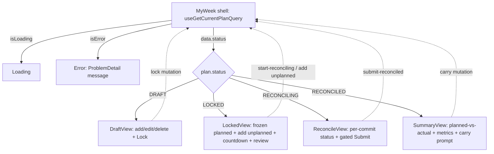

# feat: IC Lifecycle Frontend — Adaptive "My Week" (Workstream D)

## Summary

Build the IC's primary weekly surface: a single adaptive **"My Week"** screen that renders the IC's current plan and changes what is shown and editable based on the lifecycle `status` (`DRAFT → LOCKED → RECONCILING → RECONCILED`), driving the full plan → lock → reconcile → carry loop that workstream C's backend enforces. The RCDO Supporting Outcome link is the unskippable, always-visible spine of every commitment — the design choice that makes strategic alignment structural rather than an optional field.

D is **full-stack**: it first adds two ownership-checked backend *read* endpoints (the plan's commitments list and a plan-by-id fetch) that C does not expose and the UI cannot render without, then builds the React screens on top. (see origin: `docs/brainstorms/ic-lifecycle-frontend-requirements.md`)

---

## Problem Frame

Workstream C built and merged the lifecycle engine and exposes it over JWT-secured REST, but there is no IC-facing UI — the engine has no hands. D is the screen layer over the lifecycle flows F1–F4. **D does not re-decide any lifecycle rule** (immutability, deadlines, the all-statused submit gate, carry eligibility, metric semantics); it surfaces them. The failure mode to avoid is "15Five with extra steps": a form where the RCDO link is just another optional box. The screen must make the link unskippable and the lifecycle gates feel consequential.

**Confirmed during planning research:**
- There is **no router** in the repo and none is needed. The adaptive view switches on `plan.status`; lazy loading uses the existing `React.lazy` + `Suspense` pattern from `frontend/src/WeeklyCommitApp.tsx` (satisfies origin UX-R16/R17). D adds no react-router and no new Module Federation entry.
- C **does** enable `spring.mvc.problemdetails` (`backend/src/main/resources/application.yml`), so RFC 7807 ProblemDetail error bodies are real — origin UX-R15/AE-D11 are valid.
- D is the **first** workstream to add RTK Query mutations and the **first** to use `flowbite-react` components; both are wired (`tailwind.config.js`, `package.json`) but have no in-repo usage example yet. D establishes the convention.

---

## Scope Boundaries

### In scope
- Two backend read endpoints: `GET /api/lifecycle/plans/{planId}/commitments` and `GET /api/lifecycle/plans/{planId}`, ownership-checked via `OwnedPlanLoader`.
- The RTK Query lifecycle layer: all of C's IC-facing endpoints as queries/mutations, with `providesTags`/`invalidatesTags` so the adaptive view refetches after every action.
- A selectable RCDO Supporting Outcome picker (leaf-only selection) over B's existing `getRcdoTree` query.
- The adaptive "My Week" screen across all four lifecycle states, the full plan → lock → reconcile → carry loop.
- Read-only display of a manager review if one exists.
- Loading / empty / error states everywhere, with ProblemDetail-aware error messages.
- Component tests (Vitest + happy-dom) mirroring the existing pattern.

### Deferred to Follow-Up Work
- Cypress/Gherkin E2E for the full IC flow — deferred to workstream G, consistent with how B and C punted E2E there.
- Optimistic UI updates and a live-ticking deadline countdown — a displayed deadline + refetch-on-action is sufficient first (origin: Deferred for later).

### Outside this product's identity (carried from origin)
- The **manager dashboard / team roll-up UI** (workstream F). D is IC-facing only; it never builds manager-side review-writing or team views. D only *reads* a manager review.
- The **chess layer** categorization/prioritization (workstream E).
- Any change to C's **lifecycle rules** (states, transitions, immutability, deadlines, metric semantics). The only backend additions are the two read endpoints (no new lifecycle behavior).
- **RCDO hierarchy management** and a formal **design system / DESIGN.md** — D reuses B's read-only tree data and builds on Tailwind + Flowbite defaults.

---

## Requirements Traceability

Origin requirements UX-R1–UX-R19 and acceptance examples AE-D1–AE-D11.

| Requirement | Theme | Unit(s) |
|---|---|---|
| UX-R18, UX-R19 | Backend read endpoints (commitments list, plan-by-id) | U1 |
| UX-R14 | RTK Query layer, tags, invalidation | U2 |
| UX-R4, UX-R5 | RCDO Supporting Outcome picker (unskippable spine) | U3 |
| UX-R1, UX-R2, UX-R3 | Adaptive shell, state legibility, status styling | U4 |
| UX-R6, UX-R7 | DRAFT: add/edit/delete + lock + "no plan" | U5 |
| UX-R8 | LOCKED: frozen planned + appendable unplanned | U6 |
| UX-R9, UX-R10 | RECONCILING: per-commit status + submit gate | U7 |
| UX-R11 | RECONCILED: planned-vs-actual summary + two-axis metrics | U8 |
| UX-R12 | Carry-forward candidate selection | U9 |
| UX-R13 | Read-only manager review display | U10 |
| UX-R15 | ProblemDetail-aware error display (cross-cutting) | U2, U4 (and every view) |
| UX-R16, UX-R17 | Lazy boundaries, single MF entry | U4 |
| AE-D1…AE-D11 | Acceptance examples | mapped per-unit in Test scenarios |

---

## Key Technical Decisions

### KTD 1 — Adaptive single view switching on `plan.status`, no router

The "My Week" screen reads the current plan and renders one of four mode sub-views by `switch (plan.status)`. There is no URL routing; the lifecycle state *is* the navigation (origin Key Decision). Lazy loading uses `React.lazy` + `Suspense` (mirroring `WeeklyCommitApp.tsx`) for the heavier sub-views (reconcile panel, carry picker, RCDO picker modal). No react-router dependency, no new MF remote entry (UX-R16/R17).

**Why:** The plan is one entity moving through states; per-phase routes would make the IC walk a wizard and weaken "one plan, one place." The repo has no router and the MF contract exposes a single entry — adding routing would contradict both the substrate and the origin decision.

### KTD 2 — Backend read endpoints on `LifecycleController`, separate from a fatter plan DTO

Add `GET /api/lifecycle/plans/{planId}/commitments` → `List<CommitmentDto>` and `GET /api/lifecycle/plans/{planId}` → `WeeklyPlanDto` to the existing `LifecycleController` (which already owns plan-level reads `current` + `metrics`), each gated by `OwnedPlanLoader.loadOwned`. We do **not** embed commitments in `WeeklyPlanDto`.

**Why:** A separate commitments-list endpoint keeps plan-fetch and commitment-fetch independently cacheable/invalidatable in RTK Query (origin Key Decision) and leaves C's existing `WeeklyPlanDto` contract intact. Placing both on `LifecycleController` mirrors its existing GET shapes; the repository method `findByWeeklyPlanId` already exists, so the endpoints are pure reads with no new lifecycle behavior.

### KTD 3 — A new selectable RCDO picker variant, not a retrofit of B's `RcdoTree`

Build a new `RcdoPicker` component (in a Flowbite modal) over the existing `getRcdoTree` query. It renders all levels for navigation context but makes only `SUPPORTING_OUTCOME` nodes selectable, calling `onSelect(node)`. B's read-only `RcdoTree` is left unchanged.

**Why:** `RcdoTree` is a read-only viewer with no selection concept; retrofitting selection would couple the viewer to picker concerns. The `RcdoNode.nodeType` discriminator already supports leaf-only selection, and selecting only `SUPPORTING_OUTCOME` mirrors C's server rule (`CommitmentService` rejects non-Supporting-Outcome links with 422), so the UI constraint matches the contract. The `TYPE_LABEL` map from `RcdoTree` is reused for level labels.

### KTD 4 — One RTK Query slice, D adds the first mutations + the lifecycle tag types

Extend the single `createApi` slice in `frontend/src/store/api.ts` (no `injectEndpoints`). Add tag types (`WeeklyPlan`, `Commitment`, `CarryCandidate`, `ManagerReview`, `PlanMetrics`); read endpoints `providesTags`, every mutation `invalidatesTags` the tags whose data it changes (e.g. lock invalidates `WeeklyPlan`; set-status invalidates `Commitment` + `PlanMetrics`; carry invalidates `WeeklyPlan` + `Commitment` + `CarryCandidate`). Reuse the existing token-injecting `baseQuery` — no separate auth path.

**Why:** Matches the established single-slice convention (A/B). Tag-based invalidation is what makes the adaptive view auto-refresh after each action (UX-R14) without manual refetch calls. D is the first to write `invalidatesTags`; it follows B's existing `providesTags` tag-object style.

### KTD 5 — ProblemDetail-aware error display via a shared helper

C returns RFC 7807 `application/problem+json` bodies (`problemdetails` enabled). Add a small shared helper that extracts a human-readable message from an RTK Query error (`error.data.detail` / `.title`, with a sensible fallback), and use it in every view's `if (isError)` branch (keeping the `role="alert"` shape). Mutation failures (e.g. illegal transition 409, ownership 403, submit-gate 422) surface the server's reason.

**Why:** UX-R15/AE-D11. The existing components render hardcoded error strings; D needs real messages so an IC sees *why* an action failed. One helper keeps it consistent across ~6 views and is the natural seam to unit-test the ProblemDetail shape.

### KTD 6 — Status styling as a small shared token map, no design system

Define a small shared module mapping the four `PlanStatus` values and five `ReconciliationStatus` values to consistent Flowbite/Tailwind styling (badge color, label). No `DESIGN.md`. Reuse across the shell, commitment rows, and reconcile/summary views so state reads consistently (UX-R3).

**Why:** Right-sized for a first functional pass (origin Key Decision). A shared token map gives enough visual system for state legibility without the cost of a design consultation, and keeps the 9 status values from drifting in styling across views.

---

## High-Level Technical Design

*This illustrates the intended approach and is directional guidance for review, not implementation specification. The implementing agent should treat it as context, not code to reproduce.*

### Adaptive shell — state drives the view



Every mutation invalidates tags → the shell's `useGetCurrentPlanQuery` (and commitments query) refetch → the view re-renders in the new state. No manual navigation.

### Commitment row — the RCDO link as spine

```
[ Supporting Outcome: "Ship usage-based billing" ▸ (ancestry) ]   <- always visible (UX-R5)
  Title: "Draft pricing tiers"        [unplanned badge if !planned]
  (DRAFT: edit/delete)  (LOCKED+planned: frozen)  (RECONCILING: status selector)
```

Add-commitment flow: title field + **Pick Supporting Outcome** button → `RcdoPicker` modal → on select, the row shows the Outcome; save is disabled until an Outcome is selected (UX-R4 / AE-D1).

---

## Output Structure

New frontend files (repo-relative). Screens live under `frontend/src/routes/` and shared pieces under `frontend/src/components/` (new dir) per the existing naming:

```
frontend/src/
    store/api.ts                      # MODIFIED: lifecycle endpoints, tags, types (U2)
    lib/problemDetail.ts              # error-message helper (U2/KTD5)
    lib/statusStyles.ts               # PlanStatus + ReconciliationStatus token map (KTD6)
    components/
        RcdoPicker.tsx                # selectable Supporting Outcome modal (U3)
        CommitmentRow.tsx             # row with always-visible RCDO link (U5/U6/U7)
        StatusBadge.tsx               # shared status badge (KTD6)
    routes/
        MyWeek.tsx                    # adaptive shell, switch(status) (U4)
        myweek/DraftView.tsx          # DRAFT mode (U5)
        myweek/LockedView.tsx         # LOCKED mode (U6)
        myweek/ReconcileView.tsx      # RECONCILING mode (U7)
        myweek/SummaryView.tsx        # RECONCILED summary + metrics (U8)
        myweek/CarryForwardPanel.tsx  # carry candidate selection (U9)
        myweek/ManagerReviewNote.tsx  # read-only review display (U10)
    __tests__/                        # mirrored component tests per unit
backend/src/main/java/com/weeklycommit/lifecycle/
    LifecycleController.java          # MODIFIED: two GET endpoints (U1)
    LifecycleService.java             # MODIFIED: getPlan + listCommitments (U1)
backend/src/test/java/com/weeklycommit/lifecycle/
    LifecycleControllerTest.java      # MODIFIED: new endpoint tests (U1)
```

Per-unit `**Files:**` are authoritative; this tree is the scope overview. Exact sub-view file boundaries may flex during implementation.

---

## Implementation Units

### U1. Backend read endpoints: plan-by-id and plan commitments

**Goal:** The UI can fetch a plan by id and list a plan's commitments — the two reads C does not expose and the screen cannot render without.

**Requirements:** UX-R18, UX-R19.

**Dependencies:** none (builds on merged C).

**Files:**
- `backend/src/main/java/com/weeklycommit/lifecycle/LifecycleController.java` (modify — add two `@GetMapping`s)
- `backend/src/main/java/com/weeklycommit/lifecycle/LifecycleService.java` (modify — add `getPlan(UUID)` and `listCommitments(UUID)`)
- `backend/src/test/java/com/weeklycommit/lifecycle/LifecycleControllerTest.java` (modify)
- `backend/src/test/java/com/weeklycommit/lifecycle/LifecycleServiceTest.java` (modify)

**Approach:** `GET /api/lifecycle/plans/{planId}` → `WeeklyPlanDto` (reuse the existing `toDto(plan)` helper that joins `commitmentCount`). `GET /api/lifecycle/plans/{planId}/commitments` → `List<CommitmentDto>` via `CommitmentRepository.findByWeeklyPlanId(planId).stream().map(CommitmentDto::from)`. Both call `ownedPlanLoader.loadOwned(planId)` first (404 missing, 403 wrong owner) before returning data — pure reads, no new lifecycle behavior. Mirror the existing `current`/`metrics` GET shapes.

**Patterns to follow:**
- GET endpoint shape + ownership: `backend/src/main/java/com/weeklycommit/lifecycle/LifecycleController.java` (`current`, `metrics`), `OwnedPlanLoader.java`
- Service read + DTO mapping: `LifecycleService.java` (`toDto`), `CommitmentDto.from`, `CommitmentRepository.findByWeeklyPlanId`
- Controller IT with MockMvc + bearer token + ownership cases: `backend/src/test/java/com/weeklycommit/lifecycle/LifecycleControllerTest.java`

**Test scenarios:**
- `GET /plans/{id}` for an owned plan → 200 + the `WeeklyPlanDto` (status, commitmentCount, etc.).
- `GET /plans/{id}/commitments` for an owned plan with planned + unplanned commitments → 200 + a list containing both, with `planned` and `reconciliationStatus` fields populated.
- `GET /plans/{id}/commitments` for a plan with no commitments → 200 + empty list.
- Either endpoint, plan owned by a different principal → 403.
- Either endpoint, unknown plan id → 404.
- Either endpoint without a JWT → 401 (secured-by-default).

**Verification:** `./gradlew check` green; both endpoints return the right shapes and enforce ownership.

---

### U2. RTK Query lifecycle layer: types, queries, mutations, invalidation, error helper

**Goal:** Every IC-facing C endpoint is available as a typed RTK Query hook, with tag-based cache invalidation so the adaptive view auto-refreshes, plus a shared ProblemDetail error-message helper.

**Requirements:** UX-R14, UX-R15.

**Dependencies:** U1 (the two new reads must exist to wire).

**Files:**
- `frontend/src/store/api.ts` (modify — add lifecycle types, endpoints, tag types, hooks)
- `frontend/src/lib/problemDetail.ts` (create — error-message extractor)
- `frontend/src/__tests__/problemDetail.test.ts` (create)
- `frontend/src/__tests__/lifecycleApi.test.tsx` (create — exercise representative query + mutation through a tiny harness component)

**Approach:** Add TS unions/interfaces mirroring C's DTOs and enums (`PlanStatus`, `ReconciliationStatus`, `LockType`, `WeeklyPlanDto`, `CommitmentDto`, `PlanMetricsDto`, `CarryCandidateDto`, `ManagerReviewDto`) co-located in `api.ts` like the existing `RcdoNode` types. Add `tagTypes` and endpoints:
- Queries (`providesTags`): `getCurrentPlan`, `getPlan(id)`, `getPlanCommitments(planId)`, `getPlanMetrics(planId)`, `getCarryCandidates(planId)`, `getManagerReview(planId)` — note the review GET returns **204** when none exists; handle empty data as "no review."
- Mutations (`invalidatesTags`): `createCommitment`, `updateCommitment`, `deleteCommitment`, `lock`, `startReconciling`, `setCommitmentStatus`, `submitReconciled`, `carry`. Each maps to C's method/path/body (e.g. `createCommitment` → `POST /api/plans/{planId}/commitments` body `{rcdoNodeId, title}`).
- `problemDetail.ts`: given an RTK Query error, return `error.data.detail ?? error.data.title ?? <generic fallback>`; tolerate non-ProblemDetail/网络 errors.

**Execution note:** Start with a failing test for the ProblemDetail helper (the error contract) before wiring it into views.

**Patterns to follow:**
- Slice structure, `providesTags`, hook export, base query: `frontend/src/store/api.ts` (existing `getRcdoTree`/`getRcdoNode`)
- DTO/request shapes to mirror: C's `WeeklyPlanDto`, `CommitmentDto`, `PlanMetricsDto`, `CarryCandidateDto`, `ManagerReviewDto`, and request records `CommitmentRequest`/`StatusRequest`/`CarryRequest`
- Test harness: `frontend/src/test/renderWithStore.tsx`, `frontend/src/__tests__/RcdoTree.test.tsx` (fetch stubbing, token assertion)

**Test scenarios:**
- `problemDetail` returns `detail` when present; falls back to `title`; falls back to a generic message for a non-ProblemDetail/empty error. (unit)
- A representative query (`getCurrentPlan`) issues the request with the bearer token attached and returns typed data (assert via `fetchMock.mock.calls`).
- A representative mutation (`lock`) issues `POST` to the right URL and, on success, that its `invalidatesTags` triggers a refetch of the plan query (assert the second fetch happens through a harness component).
- A mutation returning a 409 ProblemDetail surfaces the `detail` via the helper.

**Verification:** `npm run build` (tsc strict) passes; `npm run test` green; hooks importable and typed.

---

### U3. Selectable RCDO Supporting Outcome picker

**Goal:** A modal picker that lets the IC choose a Supporting Outcome (leaf-only), reusing B's tree data — the interaction that makes the RCDO link unskippable.

**Requirements:** UX-R4, UX-R5. Covers AE-D2.

**Dependencies:** none (uses B's existing `getRcdoTree`); pairs with U5 where it's first consumed.

**Files:**
- `frontend/src/components/RcdoPicker.tsx` (create)
- `frontend/src/__tests__/RcdoPicker.test.tsx` (create)

**Approach:** A Flowbite `Modal` containing a tree (navigable across all levels for context) where only `nodeType === 'SUPPORTING_OUTCOME'` nodes are selectable (clickable), invoking `onSelect(node)` and closing. Non-leaf nodes are display-only ancestry context. Reuse `getRcdoTree` and the `TYPE_LABEL` map. Loading/empty/error branches per the established pattern. The picker returns enough for the row to show the Outcome title + ancestry (UX-R5).

**Patterns to follow:**
- Tree rendering + `TYPE_LABEL` + `RcdoNode` type: `frontend/src/routes/RcdoTree.tsx`, `frontend/src/store/api.ts`
- Loading/error/empty branches: `frontend/src/routes/HealthCheck.tsx`
- Flowbite Modal (first in-repo use): `flowbite-react` (wired in `tailwind.config.js`)
- Component test pattern: `frontend/src/__tests__/RcdoTree.test.tsx`

**Test scenarios:**
- `Covers AE-D2.` Opening the picker and clicking a `SUPPORTING_OUTCOME` node calls `onSelect` with that node and closes the modal.
- A non-`SUPPORTING_OUTCOME` node (Rally Cry / Outcome) is not selectable — clicking it does not call `onSelect`.
- Tree renders all levels for navigation context (a Rally Cry and its nested Supporting Outcome both appear).
- Loading state while the tree query is pending; error state (`role="alert"`) when it fails; empty state when no nodes.

**Verification:** Picker selects only leaves, returns the chosen Outcome, and renders all branch states; `npm run test` green.

---

### U4. Adaptive "My Week" shell + status styling + lazy boundaries

**Goal:** The top-level screen fetches the current plan and renders the correct mode sub-view by `status`, with consistent status styling and lazy-loaded heavy sub-views; wired into the app as the IC's main surface.

**Requirements:** UX-R1, UX-R2, UX-R3, UX-R15, UX-R16, UX-R17.

**Dependencies:** U2 (needs `getCurrentPlan` + error helper).

**Files:**
- `frontend/src/routes/MyWeek.tsx` (create — the shell)
- `frontend/src/lib/statusStyles.ts` (create — KTD 6 token map)
- `frontend/src/components/StatusBadge.tsx` (create)
- `frontend/src/App.tsx` (modify — make MyWeek the primary surface)
- `frontend/src/__tests__/MyWeek.test.tsx` (create)

**Approach:** `MyWeek` calls `useGetCurrentPlanQuery`, renders loading/error (ProblemDetail message)/data branches, then `switch (plan.status)` to a lazy-imported mode sub-view (`DraftView`/`LockedView`/`ReconcileView`/`SummaryView`, each `React.lazy` + `Suspense` per `WeeklyCommitApp.tsx`). The current status and `statusDeadline` (when set) are always visible via `StatusBadge` + a deadline display (absolute time first; ticking countdown deferred). `statusStyles.ts` maps the 9 status values to badge styling/labels. The sub-views are created in U5–U8; U4 wires the shell + one mode (DRAFT) end-to-end and stubs the others behind the switch so the shell is testable.

**Patterns to follow:**
- Hook + loading/error/data branch, `role="alert"`: `frontend/src/routes/HealthCheck.tsx`, `RcdoTree.tsx`
- Lazy + Suspense boundary: `frontend/src/WeeklyCommitApp.tsx`
- App composition: `frontend/src/App.tsx`
- Error message: `frontend/src/lib/problemDetail.ts` (U2)

**Test scenarios:**
- `Covers AE-D11.` When `getCurrentPlan` errors with a ProblemDetail body, the shell shows the `detail` message (not a bare error).
- The shell renders the DRAFT sub-view when `status === 'DRAFT'`, and the correct sub-view for each other status (can assert the lazy boundary resolves to the right mode component).
- The current status badge and a set `statusDeadline` are displayed; no deadline shown when null.
- Loading state before the plan resolves.

**Verification:** Shell adapts to status, shows state + deadline, surfaces ProblemDetail errors; `npm run build` + `npm run test` green; MF remote still builds (`npm run build` emits `remoteEntry`).

---

### U5. DRAFT view: add/edit/delete commitments + lock

**Goal:** In DRAFT, the IC builds the plan — adds commitments (each requiring a Supporting Outcome via the picker), edits/deletes them, and locks the week as a deliberate action.

**Requirements:** UX-R4, UX-R5, UX-R6, UX-R7. Covers AE-D1, AE-D3.

**Dependencies:** U2 (commitment mutations + lock), U3 (picker), U4 (shell).

**Files:**
- `frontend/src/routes/myweek/DraftView.tsx` (create)
- `frontend/src/components/CommitmentRow.tsx` (create — shared with U6/U7)
- `frontend/src/__tests__/DraftView.test.tsx` (create)

**Approach:** Lists the plan's commitments (`getPlanCommitments`) with an add form: title + **Pick Supporting Outcome** (opens `RcdoPicker`). Save is disabled until an Outcome is selected (UX-R4). Each `CommitmentRow` always shows the linked Outcome (UX-R5) and, in DRAFT, edit/delete controls. A **Lock** button confirms the consequential action (planned commitments will freeze); locking an empty plan warns and produces the "no plan" state (UX-R7) — surface `noPlan` distinctly after lock. Mutations invalidate tags → shell refetches → view flips to LOCKED.

**Patterns to follow:** U2 hooks; U3 picker; `frontend/src/routes/RcdoTree.tsx` for list rendering; Flowbite Button/Modal for the lock confirm.

**Test scenarios:**
- `Covers AE-D1.` Attempting to save a commitment with no Outcome selected: the save control is disabled / save is rejected and no `createCommitment` request fires.
- Selecting an Outcome via the picker enables save; saving issues `createCommitment` with `{rcdoNodeId, title}` and the new row shows the Outcome.
- Editing a commitment issues `updateCommitment`; deleting issues `deleteCommitment`.
- `Covers AE-D3.` Locking an empty draft shows a warning/confirm and the resulting state reflects `noPlan` distinctly.
- Locking issues the `lock` mutation; on success the view no longer shows DRAFT controls (tag invalidation refetch).
- A mutation failure (e.g. 422 bad link) shows the ProblemDetail message.

**Verification:** Full DRAFT authoring works, link is unskippable, lock transitions the view; `npm run test` green.

---

### U6. LOCKED view: frozen planned + appendable unplanned + deadline + review

**Goal:** In LOCKED, planned commitments are visibly immutable, the IC can append unplanned commitments (still link-required), the auto-advance deadline is shown, and a manager review (if any) is displayed.

**Requirements:** UX-R8, UX-R2, UX-R13. Covers AE-D4, AE-D5, AE-D9.

**Dependencies:** U2, U3, U4, U5 (`CommitmentRow`), U10 (review note — or stub then U10 fills).

**Files:**
- `frontend/src/routes/myweek/LockedView.tsx` (create)
- `frontend/src/__tests__/LockedView.test.tsx` (create)

**Approach:** Renders planned commitments as visibly frozen (no edit/delete controls — legibly immutable, not just erroring, UX-R8/AE-D4) and unplanned ones with an `unplanned` badge. An **Add unplanned commitment** affordance opens the same add flow (title + picker), creating a commitment that the server flags `planned=false` (AE-D5). Shows the `statusDeadline` and a **Start reconciling** action. Embeds `ManagerReviewNote` (U10) which shows the review comment if present. Mutations invalidate → refetch.

**Patterns to follow:** `CommitmentRow` (U5); U2 hooks; status/deadline display from U4.

**Test scenarios:**
- `Covers AE-D4.` A planned commitment in LOCKED renders with no edit/delete controls (frozen), not merely erroring on edit.
- `Covers AE-D5.` Adding a new commitment in LOCKED issues `createCommitment` and the new row shows an `unplanned` badge while planned rows stay frozen.
- The `statusDeadline` is displayed; **Start reconciling** issues `startReconciling`.
- `Covers AE-D9.` When a manager review exists, its comment is displayed read-only.
- Adding an unplanned commitment without an Outcome is blocked (link still required).

**Verification:** Planned immutability is legible, unplanned append works, deadline + review show; `npm run test` green.

---

### U7. RECONCILING view: per-commitment status + gated submit

**Goal:** In RECONCILING, the IC sets each commitment's status with an optional note, sees planned intent next to the outcome, and can submit only when all are statused.

**Requirements:** UX-R9, UX-R10. Covers AE-D6, AE-D7.

**Dependencies:** U2 (`setCommitmentStatus`, `submitReconciled`), U4, U5 (`CommitmentRow`).

**Files:**
- `frontend/src/routes/myweek/ReconcileView.tsx` (create)
- `frontend/src/__tests__/ReconcileView.test.tsx` (create)

**Approach:** Each commitment row shows a status selector offering only the IC-settable values (`DONE`/`PARTIAL`/`NOT_DONE`/`DROPPED`) — **never `UNRECONCILED`** (system-only, UX-R9) — plus an optional note field; setting issues `setCommitmentStatus`. A **Submit** button is disabled until every commitment (planned + unplanned) has a status, with a visible count of how many remain (UX-R10/AE-D6). Submit issues `submitReconciled`; on the 422 (not-all-statused, defensive) the ProblemDetail message shows.

**Patterns to follow:** `CommitmentRow` extended with a status selector; U2 hooks; `statusStyles` for status options; error helper.

**Test scenarios:**
- The status selector offers exactly `DONE`/`PARTIAL`/`NOT_DONE`/`DROPPED` and never `UNRECONCILED`.
- Setting a status issues `setCommitmentStatus` with `{status, note}`; note is optional.
- `Covers AE-D6.` With one commitment unstatused, Submit is disabled and the UI shows one remaining.
- `Covers AE-D7.` With all statused, Submit issues `submitReconciled`; on success the view leaves RECONCILING (refetch).
- A submit that returns 422 surfaces the ProblemDetail reason.

**Verification:** Per-commit statusing works, submit gate enforced in the UI, `UNRECONCILED` never offered; `npm run test` green.

---

### U8. RECONCILED summary: planned-vs-actual + two-axis metrics

**Goal:** After reconciliation, show each commitment's planned intent vs actual outcome and the two-axis metrics, displaying any `UNRECONCILED` work honestly.

**Requirements:** UX-R11. Covers AE-D10.

**Dependencies:** U2 (`getPlanMetrics`, `getPlanCommitments`), U4.

**Files:**
- `frontend/src/routes/myweek/SummaryView.tsx` (create)
- `frontend/src/__tests__/SummaryView.test.tsx` (create)

**Approach:** Renders the commitments with their final `reconciliationStatus` (planned-vs-actual), styling `UNRECONCILED` distinctly (not as done, UX-R11/AE-D10). Shows the metrics from `getPlanMetrics`: reconciliation-accuracy and planned-vs-unplanned ratio — handling `reconciliationAccuracy === null` (zero planned) as "not applicable", distinct from `0.0`. Includes the entry point to carry-forward (U9 panel).

**Patterns to follow:** U2 hooks; `statusStyles`; `PlanMetricsDto` null-accuracy convention.

**Test scenarios:**
- `Covers AE-D10.` A reconciled week with planned + unplanned commitments including an `UNRECONCILED` one: accuracy and ratio are shown, and the `UNRECONCILED` commitment is displayed as such (not as done).
- `reconciliationAccuracy === null` (zero planned) renders as "not applicable", not "0%".
- Each commitment shows its final status; planned vs unplanned are distinguishable.

**Verification:** Summary shows honest planned-vs-actual + metrics with correct null handling; `npm run test` green.

---

### U9. Carry-forward panel

**Goal:** After RECONCILED, list carry candidates with week-count, let the IC select a subset, and carry them into next week's draft.

**Requirements:** UX-R12. Covers AE-D8.

**Dependencies:** U2 (`getCarryCandidates`, `carry`), U8 (entry point).

**Files:**
- `frontend/src/routes/myweek/CarryForwardPanel.tsx` (create)
- `frontend/src/__tests__/CarryForwardPanel.test.tsx` (create)

**Approach:** Lists candidates from `getCarryCandidates` (server already returns only `PARTIAL`/`NOT_DONE` planned, never `DROPPED`/`DONE` — AE-D8 satisfied server-side), each with its `carryWeekCount` and Outcome. The IC checks a subset; **Carry selected** issues the `carry` mutation with the chosen `commitmentIds`, which invalidates tags. Confirms the items will seed next week's draft. Empty-candidates state shown when none.

**Patterns to follow:** U2 hooks; selection UI (checkboxes) + Flowbite Button; error helper.

**Test scenarios:**
- `Covers AE-D8.` Candidates list shows the returned `PARTIAL`/`NOT_DONE` items with week-count; selecting a subset and carrying issues `carry` with exactly the selected `commitmentIds`.
- Selecting none disables the carry action (or carries nothing).
- Empty candidate list shows an empty state.
- A carry failure surfaces the ProblemDetail message.

**Verification:** Candidate selection + carry works against the real candidate set; `npm run test` green.

---

### U10. Read-only manager review note

**Goal:** Display a manager's review comment on the plan if one exists, read-only.

**Requirements:** UX-R13. Covers AE-D9 (the display half).

**Dependencies:** U2 (`getManagerReview`).

**Files:**
- `frontend/src/components/ManagerReviewNote.tsx` (create)
- `frontend/src/__tests__/ManagerReviewNote.test.tsx` (create)

**Approach:** Calls `getManagerReview(planId)`; the GET returns **204** when no review exists, so absence is a valid, silent state (render nothing or a subtle "no review yet"). When present, show reviewer + comment + `reviewedAt`, read-only. No write affordance (that's workstream F). Consumed by `LockedView` (U6) and optionally the summary.

**Patterns to follow:** U2 hook; loading/empty branches; no mutation.

**Test scenarios:**
- When a review exists, the comment + reviewer are displayed read-only (no edit control).
- When the GET returns 204 / no data, the component renders nothing (or a subtle empty note) without error.
- Loading state while pending.

**Verification:** Review shows when present, absent-case is clean; `npm run test` green.

---

## System-Wide Impact

- **Backend (U1):** two additive read endpoints on `LifecycleController`; no lifecycle behavior change, no migration. Existing C tests unaffected; new tests cover the reads.
- **Frontend store:** D adds the first mutations and the first `invalidatesTags` to the shared `api.ts` slice — establishes the mutation/invalidation convention later workstreams (E/F) follow.
- **First `flowbite-react` usage:** D establishes the in-repo component convention (Modal, Button, Badge). Keep `vite.config.ts` `shared` unchanged unless a genuinely new shared dep appears.
- **Workstream F (manager dashboard)** will reuse D's RTK Query types and the `statusStyles`/`StatusBadge` modules, and will add the review-*writing* UI D deliberately omits.
- **MF remote:** all screens load behind the existing single exposed entry + `React.lazy`; no new remote entry, no `shared` change (UX-R17). Verify the remote via `npm run build && npm run preview`, not the dev server (inherited gotcha).

---

## Risks & Mitigations

| Risk | Mitigation |
|---|---|
| RTK Query cache not refreshing the adaptive view after a mutation | Every mutation declares `invalidatesTags` matching the queries' `providesTags`; U2 test asserts a mutation triggers a refetch (KTD 4) |
| Picker lets a non-Supporting-Outcome be selected → server 422 | Picker constrains selection to `nodeType === 'SUPPORTING_OUTCOME'` (KTD 3); U3 test asserts non-leaves aren't selectable |
| `UNRECONCILED` accidentally offered as a settable status | Status selector hard-codes the four IC-settable values; U7 test asserts `UNRECONCILED` never appears |
| Error states show bare failures, not reasons | Shared `problemDetail` helper in every `isError` branch (KTD 5); U2 + U4 tests assert the message surfaces |
| GET review 204 treated as an error | U10 handles empty data as a valid no-review state; tested |
| Zero-planned metrics shown as "0%" instead of "n/a" | U8 distinguishes `reconciliationAccuracy === null` from `0.0`; tested |
| Adding a router by reflex | KTD 1: no router; adaptive `switch(status)` + existing lazy boundary only |

---

## Verification Strategy

- **Backend (U1):** `cd backend && JAVA_HOME=<JDK21> ./gradlew check` — new endpoint tests + ownership cases, JaCoCo 80% gate. (Host JDK 25 breaks Gradle 8.10.2; use pinned JDK 21 — inherited note.)
- **Frontend:** `cd frontend && npm run lint && npm run test && npm run build` — ESLint, Vitest (happy-dom) component tests, tsc-strict + production build (must still emit `remoteEntry`).
- **Acceptance examples:** AE-D1–AE-D11 each pinned to a named test scenario above; all passing is the functional bar.
- **MF sanity:** `npm run build && npm run preview` to confirm the remote loads (not the dev server).
- **Deferred to G:** Cypress/Gherkin E2E for the full IC flow.

---

## Deferred Implementation Notes

- Exact sub-view file boundaries (one `MyWeek` with inline modes vs separate files under `routes/myweek/`) may flex; the Output Structure tree is the intended shape, not a constraint.
- Whether `CommitmentRow` is one component with mode props (DRAFT editable / LOCKED frozen / RECONCILING status) or thin per-mode wrappers — decide at U5/U6/U7 implementation; keep the always-visible RCDO link consistent across modes.
- Deadline display format (absolute time first; relative/ticking countdown deferred) — settle at U4.
- How much RCDO ancestry context a committed row shows (full path vs immediate parent) — a presentation detail for U3/U5.
- Whether the carry-forward panel lives inline in `SummaryView` or as a separate lazy panel — U8/U9 implementation choice.
